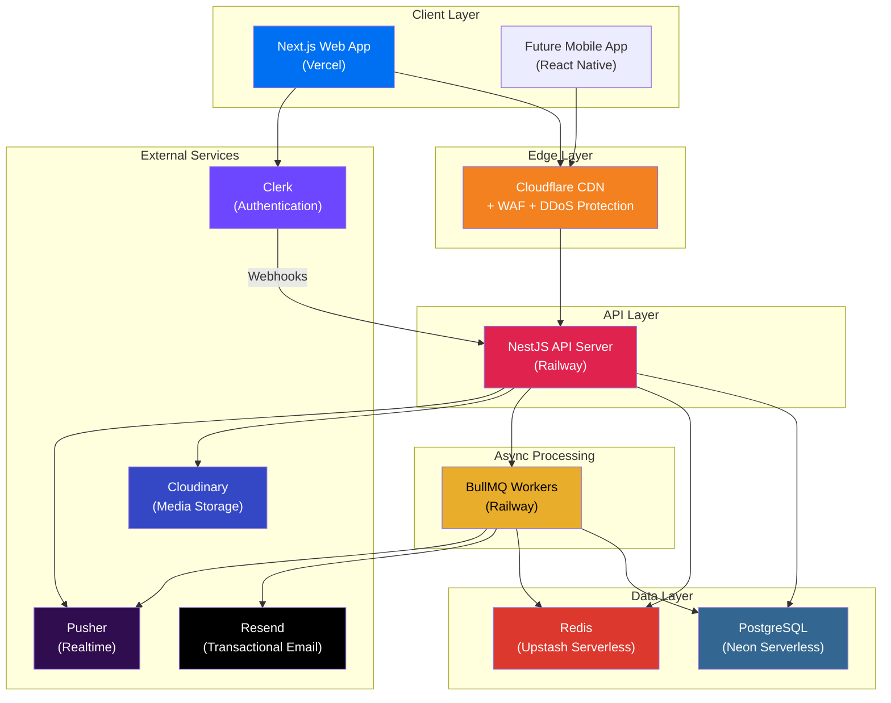
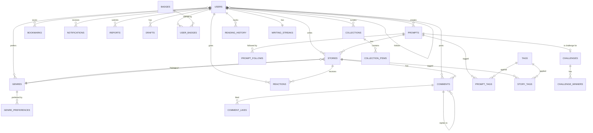
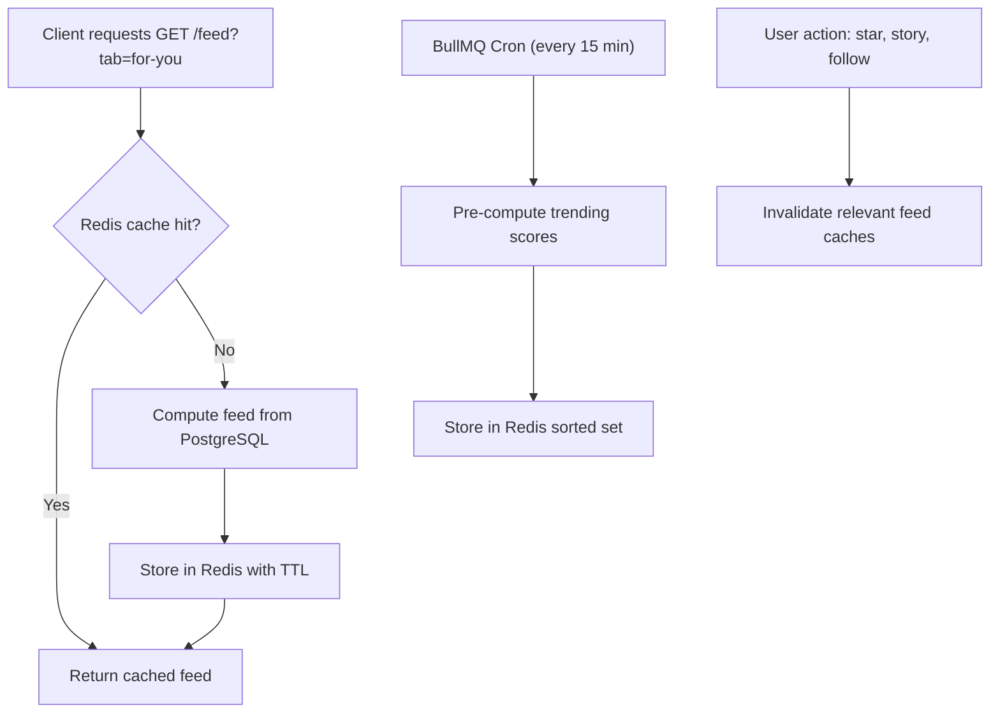
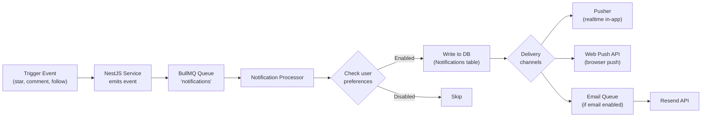
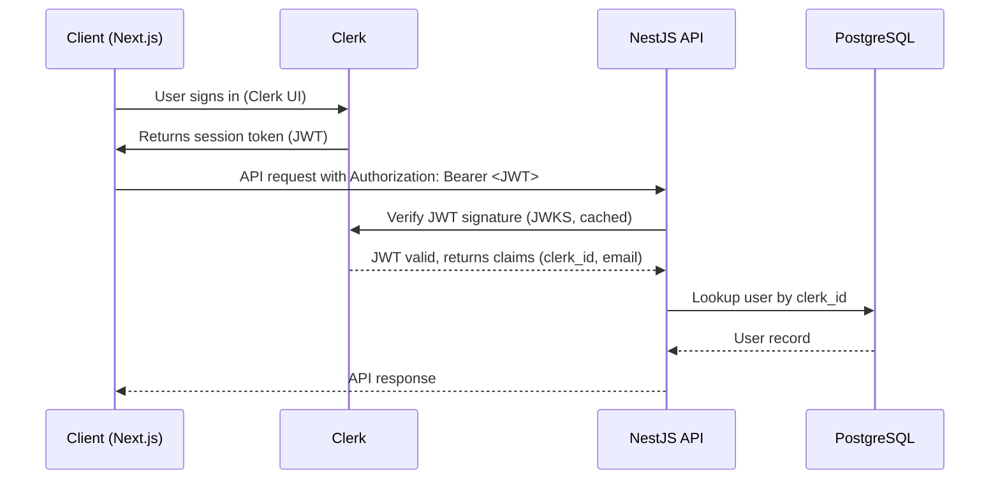
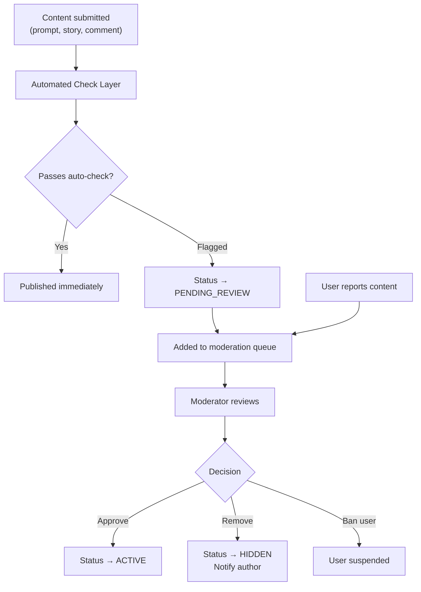
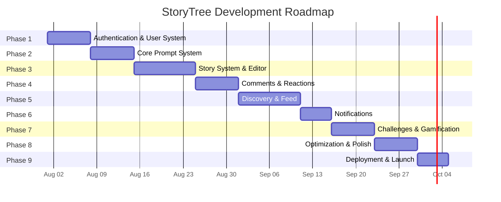

# StoryTree — Technical Architecture Document

> Production-ready technical specification for building StoryTree at startup scale.
> Version 1.0 · July 2026

---

# Section 1 — System Overview

## 1.1 Architecture Philosophy

StoryTree uses a **separated frontend/backend architecture** with a **modular monolith** backend. This is not microservices, and that is intentional.

**Why a modular monolith (not microservices):**

| Concern | Microservices | Modular Monolith (Our Choice) |
|---------|--------------|-------------------------------|
| **Team size** | Need 3-5 engineers per service | Works with 2-5 total engineers |
| **Deployment complexity** | N services × N pipelines | 1 frontend deploy + 1 backend deploy |
| **Network overhead** | Service-to-service HTTP/gRPC calls | In-process function calls |
| **Data consistency** | Distributed transactions, eventual consistency | Single database, ACID transactions |
| **Debugging** | Distributed tracing required | Single process, standard debugging |
| **Refactoring cost** | Cross-service contract changes | Module boundary refactoring |
| **When to switch** | At 50+ engineers or clear domain boundaries | — |

The modular monolith is structured so that **each module** (auth, prompts, stories, feed, etc.) has clear boundaries and could be extracted into a service later. We get monolith simplicity now and microservice optionality later.

## 1.2 High-Level System Diagram



**Request flow:**
1. Client (Next.js on Vercel) sends request
2. Cloudflare CDN handles static assets, rate limiting, DDoS protection
3. API request hits NestJS on Railway
4. NestJS authenticates via Clerk JWT, queries PostgreSQL (Neon), checks Redis cache (Upstash)
5. For async work (notifications, feed generation, email), NestJS enqueues jobs to BullMQ
6. BullMQ workers process jobs, writing to DB, sending emails via Resend, pushing realtime events via Pusher
7. Pusher delivers realtime updates to connected clients

## 1.3 Scalability Goals

| Milestone | Target | Timeline |
|-----------|--------|----------|
| Launch | 1,000 MAU, 100 concurrent | Month 1-3 |
| Growth | 50,000 MAU, 2,000 concurrent | Month 6-12 |
| Scale | 500,000 MAU, 10,000 concurrent | Year 2 |
| At scale | 5M+ MAU, 50,000 concurrent | Year 3+ |

**Key scalability requirements:**
- Feed generation: < 200ms for any feed tab at 1M users
- Story read: < 100ms p95 response time
- Search: < 300ms for full-text search results
- Database: Handle 10,000+ writes/minute at scale
- CDN: 99.9% cache hit rate for static assets

## 1.4 Performance Goals

| Metric | Target | Measurement |
|--------|--------|-------------|
| **Time to First Byte (TTFB)** | < 200ms | Server-side rendering |
| **Largest Contentful Paint (LCP)** | < 2.5s | Core Web Vital |
| **First Input Delay (FID)** | < 100ms | Core Web Vital |
| **Cumulative Layout Shift (CLS)** | < 0.1 | Core Web Vital |
| **API response (p50)** | < 50ms | Simple queries |
| **API response (p95)** | < 200ms | Complex queries (feed, search) |
| **API response (p99)** | < 500ms | Worst case |
| **Cold start** | < 3s | First meaningful paint |

## 1.5 Security Goals

| Goal | Implementation |
|------|---------------|
| **Zero plaintext secrets** | All secrets in environment variables, never committed |
| **Authentication** | Clerk-managed, JWT validation on every API call |
| **Authorization** | Role-based (user, moderator, admin) + resource ownership |
| **Input validation** | Every API endpoint validates input with class-validator DTOs |
| **SQL injection** | Prevented by Prisma ORM (parameterized queries) |
| **XSS** | React's built-in escaping + CSP headers |
| **CSRF** | SameSite cookies + CSRF tokens on mutations |
| **Rate limiting** | Per-IP and per-user rate limits via Redis |
| **DDoS** | Cloudflare WAF as first layer |
| **Data privacy** | GDPR-compliant user data handling, account deletion |

---

# Section 2 — Tech Stack

## 2.1 Frontend

### Next.js 15 (App Router)

**Choice:** Next.js 15 with App Router

**Why Next.js over Vite + React:**
- **SSR/SSG for SEO:** Story and prompt pages must be indexable by Google. A storytelling platform lives and dies by organic search traffic. Next.js provides server-side rendering out of the box.
- **React Server Components (RSC):** Feed and story content can be rendered on the server, reducing JavaScript shipped to the client. This directly improves LCP.
- **ISR (Incremental Static Regeneration):** Prompt pages with 100+ stories don't need to re-render on every request. ISR serves stale content while revalidating in the background — perfect for content that changes every few minutes, not every second.
- **Image optimization:** `next/image` handles responsive images, lazy loading, and WebP conversion automatically — critical for avatars and future media.
- **Built-in routing:** File-based routing with layouts, loading states, and error boundaries matches our page architecture 1:1.

**Why App Router over Pages Router:**
- Server Components reduce client bundle size by 30-50%
- Nested layouts (nav bar persists across route changes)
- Streaming SSR (show skeleton while data loads)
- Better data fetching patterns (fetch in server components, no `getServerSideProps` boilerplate)

### React 19

**Why:** Latest stable React with server components, concurrent features, and the `use` hook for better async data handling. The entire ecosystem (Next.js, component libraries) has stabilized on React 19.

### TypeScript (Strict Mode)

**Why:** Non-negotiable for any serious project. Type safety catches bugs at compile time, enables better IDE support, and serves as living documentation for the API surface. **Strict mode** is mandatory — no `any` types allowed in production code.

**tsconfig requirements:**
- `strict: true`
- `noUncheckedIndexedAccess: true`
- `exactOptionalPropertyTypes: true`

### Tailwind CSS v4

**Why Tailwind over vanilla CSS or CSS Modules:**
- **Design tokens → utility classes:** Our design system's spacing scale (`--space-1` through `--space-24`), color tokens, and typography scale map directly to Tailwind's config. One source of truth.
- **Co-location:** Styles live next to the JSX they affect. No file-switching, no class name invention fatigue.
- **Purging:** Only used classes ship. Bundle size stays minimal regardless of how large the design system grows.
- **Dark mode:** Built-in `dark:` variant — essential since our primary theme is dark mode.
- **Responsive:** `sm:`, `md:`, `lg:` variants map to our breakpoint system.

**Why v4 specifically:** CSS-native engine (no PostCSS dependency), `@theme` for design tokens, significantly faster builds.

**Custom theme mapping:** The design system tokens (Section 1 of the Design System doc) will be registered as Tailwind theme values:
```
colors.green.950 → --color-green-950
spacing.1 → --space-1 (4px)
borderRadius.lg → --radius-lg (12px)
```

### State Management: Zustand

**Why Zustand over Redux, Jotai, or React Context:**

| Option | Verdict | Reason |
|--------|---------|--------|
| **Redux Toolkit** | ❌ Overkill | Boilerplate-heavy for our needs. StoryTree's client state is simple (UI state, draft editor state). Server state is handled by React Query. |
| **React Context** | ❌ Performance | Context triggers re-renders on all consumers. Unusable for frequently-changing state (editor, scroll position). |
| **Jotai** | ⚠️ Good but niche | Atomic model is powerful but less intuitive for team onboarding. |
| **Zustand** | ✅ Chosen | Minimal API (one `create` function), no boilerplate, no providers, selective re-rendering, DevTools support, 1KB bundle. |

**What lives in Zustand (client state):**
- Editor state (draft content, formatting, word count)
- UI state (active tab, modal visibility, sidebar open/closed)
- Optimistic updates (reaction toggled, bookmark toggled)

**What does NOT live in Zustand (server state):**
- Feed data, story content, user profiles, notifications — all handled by **TanStack Query** (React Query) with caching, refetching, and optimistic updates.

### TanStack Query (React Query v5)

**Why:** Manages all server state — caching, background refetching, optimistic updates, pagination, and infinite scroll. This is the library that makes the feed feel instant (cache-first, revalidate in background).

### UI Component Library: shadcn/ui

**Why shadcn/ui over Radix, Chakra, MUI, or Ant Design:**

| Option | Verdict | Reason |
|--------|---------|--------|
| **MUI / Ant Design** | ❌ | Opinionated styling conflicts with our custom design system. Over-engineered for our needs. |
| **Chakra UI** | ❌ | Good DX but style system conflicts with Tailwind. |
| **Headless (Radix only)** | ⚠️ | Full flexibility but we'd build every component from scratch. |
| **shadcn/ui** | ✅ Chosen | Copy-paste components built on Radix primitives + Tailwind. We own the code (no dependency lock-in), fully customizable to match our design system, accessible by default (Radix handles ARIA). |

**Key benefit:** shadcn/ui components are **copied into the project**, not imported from `node_modules`. This means we can modify every component to match our exact design system specs without fighting an upstream library.

---

## 2.2 Backend

### NestJS

**Why NestJS over Express:**

| Concern | Express | NestJS (Our Choice) |
|---------|---------|---------------------|
| **Structure** | None — freeform | Enforced modules/controllers/services |
| **Dependency Injection** | Manual or third-party | Built-in, powerful |
| **Validation** | Manual + express-validator | Built-in pipes + class-validator decorators |
| **Authentication** | passport.js (manual setup) | Guards + decorators + Passport integration |
| **API documentation** | Manual swagger setup | `@nestjs/swagger` generates from decorators |
| **WebSockets** | socket.io (separate setup) | `@nestjs/websockets` integrated |
| **Job queues** | bull (separate setup) | `@nestjs/bull` integrated |
| **Testing** | Mocha/Jest (manual DI) | Built-in testing module with DI |
| **Team scalability** | Gets messy at 20+ routes | Modules enforce separation of concerns |
| **Learning curve** | Low | Medium (Angular-like decorators) |

**The deciding factor:** At 50+ API endpoints (which StoryTree will have), Express becomes spaghetti without heavy custom scaffolding. NestJS provides that scaffolding out of the box. The team doesn't need to invent project structure — it's enforced.

### Node.js Runtime

**Version:** Node.js 22 LTS
**Why Node.js:** JavaScript/TypeScript across the full stack. Same language, same types, same utilities. Smaller team can move faster.

---

## 2.3 Database

### PostgreSQL via Neon

**Why PostgreSQL:**
- **Relational data model:** StoryTree's data is deeply relational (users → prompts → stories → comments → reactions). A relational database with proper foreign keys and joins is the natural fit.
- **Full-text search:** PostgreSQL's `tsvector` + GIN indexes provide production-quality full-text search without a separate search service. This covers V1 entirely.
- **JSON support:** `jsonb` columns for flexible metadata (notification payloads, badge conditions) without separate document stores.
- **Mature ecosystem:** Best tooling, best ORM support, best community.

**Why Neon over Supabase, PlanetScale, or self-hosted:**

| Option | Verdict | Reason |
|--------|---------|--------|
| **Supabase** | ❌ | Bundles too much (auth, storage, realtime). We use Clerk, Cloudinary, Pusher. Paying for unused features. |
| **PlanetScale** | ❌ | MySQL-based. Prisma + PostgreSQL has better ecosystem support. PlanetScale also deprecated free tier. |
| **Self-hosted (RDS)** | ❌ | Operational overhead. A 3-person startup shouldn't manage database servers. |
| **Neon** | ✅ Chosen | Serverless PostgreSQL, scales to zero, branching for dev/staging, instant provisioning, generous free tier, Prisma-native support. |

**Neon-specific benefits:**
- **Branching:** Create a database branch for every PR (like Git branches). Test migrations without touching production.
- **Scale to zero:** No cost when idle — critical for a pre-revenue startup.
- **Auto-scaling:** Compute scales up during traffic spikes, scales down during quiet periods.
- **Connection pooling:** Built-in PgBouncer — no need to manage connection pools manually.

### Prisma ORM

**Why Prisma over TypeORM, Drizzle, or raw SQL:**

| Option | Verdict | Reason |
|--------|---------|--------|
| **TypeORM** | ❌ | Active Record pattern leads to bloated models. Decorator-heavy. Migration system is unreliable. |
| **Drizzle** | ⚠️ | Excellent SQL-like API, lighter than Prisma. But smaller ecosystem, less mature migrations. |
| **Raw SQL** | ❌ | No type safety, no migration system, manual query building. |
| **Prisma** | ✅ Chosen | Type-safe queries generated from schema, excellent migration system, visual studio (Prisma Studio), relation handling, middleware hooks. |

**Prisma tradeoffs we accept:**
- Prisma generates a client from the schema, adding a build step. Acceptable.
- Complex queries (feed ranking, aggregations) may need `$queryRaw` for raw SQL. Acceptable — Prisma handles 90%, raw SQL handles 10%.

---

## 2.4 Authentication: Clerk

**Why Clerk over Auth.js (NextAuth):**

| Concern | Auth.js | Clerk (Our Choice) |
|---------|---------|---------------------|
| **Setup time** | 4-8 hours (configure providers, session, callbacks) | 30 minutes (drop-in components) |
| **Social login** | Manual per provider | Google, Apple, GitHub pre-configured |
| **UI components** | None (build your own) | Pre-built sign-in/up, customizable |
| **User management** | None (build your own) | Dashboard for admins |
| **MFA** | Manual implementation | Built-in TOTP + SMS |
| **Session management** | JWT or database sessions (manual) | Managed, secure by default |
| **Webhooks** | None | User events (create, update, delete) |
| **Cost** | Free (self-hosted) | Free up to 10K MAU, then $0.02/MAU |
| **Security liability** | You own it | Clerk owns it |

**The deciding factor:** Auth is a security-critical system. Building it yourself is a liability. Clerk is SOC2 certified, handles session management, token rotation, and attack detection. A startup's time is better spent on product, not auth infrastructure.

**Integration pattern:**
1. Frontend: Clerk's `<SignIn />` and `<SignUp />` components (customized to match our design system)
2. Backend: Clerk's JWT is sent in the `Authorization` header. NestJS validates it using Clerk's public key.
3. User sync: Clerk sends a webhook on user creation → NestJS creates a corresponding `User` row in PostgreSQL.

---

## 2.5 Storage: Cloudinary

**Why Cloudinary over S3, UploadThing, or Supabase Storage:**

| Option | Verdict | Reason |
|--------|---------|--------|
| **AWS S3** | ❌ | Raw storage. No image transformation, no CDN, no face detection. Need to build a processing pipeline on top. |
| **UploadThing** | ⚠️ | Good DX, simple API. But no image transformations (resize, crop, WebP conversion). Fine for file upload, not for image-heavy use. |
| **Supabase Storage** | ❌ | Tied to Supabase ecosystem. Basic transformations. |
| **Cloudinary** | ✅ Chosen | Upload, transform, optimize, and serve images from one API. Face-detection for avatar cropping. Automatic WebP/AVIF conversion. Global CDN. Generous free tier (25K transformations/month). |

**What we store on Cloudinary:**
- User avatars (auto-cropped, resized to 120px/80px/40px/24px variants)
- Future: story cover images, challenge banners, collection thumbnails

**Optimization pipeline:**
1. User uploads image → Cloudinary
2. Cloudinary auto-detects faces for smart cropping
3. Cloudinary generates responsive variants (xs, sm, md, lg, xl)
4. URLs served via Cloudinary's CDN with format auto-negotiation (WebP for Chrome, AVIF for Safari)

---

## 2.6 Caching: Upstash Redis

**Why Upstash over self-hosted Redis, ElastiCache, or Momento:**

| Option | Verdict | Reason |
|--------|---------|--------|
| **Self-hosted Redis** | ❌ | Operational overhead. Memory management. Single point of failure. |
| **AWS ElastiCache** | ❌ | Over-provisioned for early stage. Minimum ~$15/month for smallest instance. |
| **Momento** | ⚠️ | Serverless cache, but less Redis-compatible. Smaller ecosystem. |
| **Upstash** | ✅ Chosen | Serverless Redis. Pay per request ($0.2/100K commands). REST API works from serverless/edge. Global replication. BullMQ compatible. |

**What we cache:**
- Feed results (per user, per tab, TTL 5 minutes)
- Prompt metadata (story count, genre distribution, TTL 2 minutes)
- User session data (profile, level, rings, TTL 15 minutes)
- Rate limiting counters (per IP, per user)
- Trending/hot scores (computed hourly, cached)

---

## 2.7 Queue: BullMQ

**Why BullMQ:**
- Runs on Redis (Upstash) — no additional infrastructure
- Priority queues, delayed jobs, rate-limited processing, retries with backoff
- Built-in NestJS integration (`@nestjs/bullmq`)
- Dashboard (Bull Board) for monitoring

**What runs in queues:**
- Notification fan-out (when a story gets 50 reactions, don't block the API)
- Feed pre-computation (generate "For You" feeds in background)
- Email sending (welcome emails, streak reminders, challenge announcements)
- Badge checking (after every story publish, check if user earned new badges)
- Search index updates (reindex story after edit)
- Analytics aggregation (compute trending scores hourly)

---

## 2.8 Realtime: Pusher

**Why Pusher over Socket.io/raw WebSockets:**

| Concern | Socket.io | Pusher (Our Choice) |
|---------|-----------|---------------------|
| **Infrastructure** | Need persistent WebSocket server | Managed — no infrastructure |
| **Scaling** | Sticky sessions, Redis adapter | Automatic |
| **Serverless compat** | ❌ Incompatible with Vercel | ✅ Works everywhere |
| **Client libraries** | JavaScript only (others community) | Official libs for JS, React Native, iOS, Android |
| **Cost** | Free (but ops cost) | Free up to 200K messages/day, then $49/month |
| **Migration path** | — | Can move to Socket.io on NestJS later if cost becomes an issue |

**What we use realtime for:**
- New reactions on a story you're reading (live counter updates)
- New comments while reading a story
- Notification badge count updates
- Challenge timer sync

**Why NOT Socket.io for V1:** Vercel (our frontend host) doesn't support persistent WebSocket connections. We'd need a separate WebSocket server on Railway. Pusher eliminates this complexity. When we have dedicated infrastructure engineers, we can migrate.

---

## 2.9 Transactional Email: Resend

**Why:** Modern email API with React Email support (write emails as React components). Simple pricing, excellent deliverability, built-in analytics. Better DX than SendGrid or Mailgun.

**Emails we send:**
- Welcome email (after sign-up)
- Weekly challenge announcement
- Streak warning ("Your streak ends today!")
- Weekly digest (optional, for re-engagement)

---

## 2.10 Deployment

| Service | Platform | Why |
|---------|----------|-----|
| **Frontend (Next.js)** | **Vercel** | Built by the Next.js team. Zero-config deployment, edge functions, ISR support, preview deployments per PR. |
| **Backend (NestJS)** | **Railway** | Simple container deployment with auto-scaling. Supports persistent processes (needed for BullMQ workers). Fixed pricing ($5/month base). |
| **Database** | **Neon** | Serverless PostgreSQL with branching. Scale to zero. |
| **Cache/Queue** | **Upstash** | Serverless Redis. Pay per request. BullMQ compatible. |
| **CDN / WAF** | **Cloudflare** | Free tier handles DDoS protection, CDN, and DNS. Cloudflare Pages for static assets. |
| **Media** | **Cloudinary** | Image storage + CDN + transformation. |
| **Auth** | **Clerk** | Managed authentication. |
| **Realtime** | **Pusher** | Managed WebSocket channels. |
| **Email** | **Resend** | Transactional email delivery. |

**Monthly cost estimate (early stage, <10K users):**

| Service | Estimated Cost |
|---------|---------------|
| Vercel (Pro) | $20/month |
| Railway (backend + workers) | $10-20/month |
| Neon (Pro) | $19/month |
| Upstash (Pay-as-go) | $5-10/month |
| Cloudflare (Free) | $0 |
| Cloudinary (Free tier) | $0 |
| Clerk (Free up to 10K) | $0 |
| Pusher (Free tier) | $0 |
| Resend (Free up to 3K/month) | $0 |
| **Total** | **~$55-70/month** |

> [!TIP]
> This stack is designed to cost under $100/month until 10K users. The serverless/pay-per-use model means costs scale linearly with usage, not with provisioned capacity. No idle servers burning money.

---

# Section 3 — Database Design

## 3.1 Design Principles

1. **UUIDs for primary keys** — Globally unique, no auto-increment collisions, safe for distributed systems and URL exposure.
2. **Denormalized counters** — `story_count` on Prompts, `star_count` on Stories. Avoids expensive `COUNT(*)` queries on every page load. Updated via database triggers or application-level increments.
3. **Soft deletes** — Content uses `status` enums (`ACTIVE`, `HIDDEN`, `DELETED`) instead of `DELETE` queries. Enables moderation review and undo.
4. **Timestamps everywhere** — `created_at` and `updated_at` on every table. `updated_at` auto-updates via Prisma's `@updatedAt`.
5. **One story per prompt per user** — Enforced by a unique constraint on `(prompt_id, author_id)` in the Stories table.

## 3.2 Entity-Relationship Diagram



## 3.3 Table Definitions

### Users

**Purpose:** Core user entity. Synced from Clerk on sign-up. Stores profile data and aggregate metrics.

| Column | Type | Constraints | Description |
|--------|------|-------------|-------------|
| `id` | `UUID` | `PK, DEFAULT gen_random_uuid()` | Internal user ID |
| `clerk_id` | `VARCHAR(64)` | `UNIQUE, NOT NULL` | Clerk's external user ID |
| `username` | `VARCHAR(30)` | `UNIQUE, NOT NULL` | URL-safe username |
| `email` | `VARCHAR(255)` | `UNIQUE, NOT NULL` | Email from Clerk |
| `display_name` | `VARCHAR(50)` | `NOT NULL` | Display name |
| `bio` | `VARCHAR(200)` | `DEFAULT ''` | Profile bio |
| `avatar_url` | `TEXT` | `NULLABLE` | Cloudinary URL |
| `level` | `ENUM` | `NOT NULL, DEFAULT 'SEED'` | SEED, SPROUT, SAPLING, OAK, SEQUOIA, ANCIENT |
| `rings` | `INTEGER` | `NOT NULL, DEFAULT 0, CHECK >= 0` | Reputation points |
| `story_count` | `INTEGER` | `NOT NULL, DEFAULT 0` | Denormalized |
| `prompt_count` | `INTEGER` | `NOT NULL, DEFAULT 0` | Denormalized |
| `follower_count` | `INTEGER` | `NOT NULL, DEFAULT 0` | Denormalized |
| `following_count` | `INTEGER` | `NOT NULL, DEFAULT 0` | Denormalized |
| `is_verified` | `BOOLEAN` | `NOT NULL, DEFAULT false` | Staff-verified notable writer |
| `is_admin` | `BOOLEAN` | `NOT NULL, DEFAULT false` | Admin flag |
| `is_moderator` | `BOOLEAN` | `NOT NULL, DEFAULT false` | Moderator flag |
| `onboarding_completed` | `BOOLEAN` | `NOT NULL, DEFAULT false` | Has completed onboarding |
| `created_at` | `TIMESTAMPTZ` | `NOT NULL, DEFAULT NOW()` | — |
| `updated_at` | `TIMESTAMPTZ` | `NOT NULL, @updatedAt` | — |

**Indexes:**
- `UNIQUE INDEX idx_users_clerk_id ON users(clerk_id)`
- `UNIQUE INDEX idx_users_username ON users(username)`
- `UNIQUE INDEX idx_users_email ON users(email)`
- `INDEX idx_users_created_at ON users(created_at DESC)`

---

### Genres

**Purpose:** Fixed set of story genres. Seeded at database creation. Rarely changes.

| Column | Type | Constraints | Description |
|--------|------|-------------|-------------|
| `id` | `SERIAL` | `PK` | — |
| `name` | `VARCHAR(30)` | `UNIQUE, NOT NULL` | "Horror", "Sci-Fi", etc. |
| `slug` | `VARCHAR(30)` | `UNIQUE, NOT NULL` | "horror", "sci-fi" |
| `emoji` | `VARCHAR(10)` | `NOT NULL` | "🩸", "🚀", etc. |
| `color` | `VARCHAR(7)` | `NOT NULL` | Hex color code |
| `display_order` | `INTEGER` | `NOT NULL` | Sort order |

**Seed data:** 8 genres as defined in the Product Design Document.

---

### Prompts

**Purpose:** Creative seeds that spawn stories. The root node of the StoryTree data model.

| Column | Type | Constraints | Description |
|--------|------|-------------|-------------|
| `id` | `UUID` | `PK, DEFAULT gen_random_uuid()` | — |
| `author_id` | `UUID` | `FK → Users(id), NOT NULL` | Creator |
| `text` | `VARCHAR(500)` | `NOT NULL, CHECK length >= 20` | Prompt text |
| `slug` | `VARCHAR(120)` | `UNIQUE, NOT NULL` | URL slug (generated from text) |
| `story_count` | `INTEGER` | `NOT NULL, DEFAULT 0` | Denormalized |
| `bookmark_count` | `INTEGER` | `NOT NULL, DEFAULT 0` | Denormalized |
| `total_star_count` | `INTEGER` | `NOT NULL, DEFAULT 0` | Sum of all story stars (for ranking) |
| `is_staff_pick` | `BOOLEAN` | `NOT NULL, DEFAULT false` | Editorially featured |
| `status` | `ENUM` | `NOT NULL, DEFAULT 'ACTIVE'` | ACTIVE, HIDDEN, DELETED |
| `created_at` | `TIMESTAMPTZ` | `NOT NULL, DEFAULT NOW()` | — |
| `updated_at` | `TIMESTAMPTZ` | `NOT NULL, @updatedAt` | — |

**Indexes:**
- `UNIQUE INDEX idx_prompts_slug ON prompts(slug)`
- `INDEX idx_prompts_author ON prompts(author_id)`
- `INDEX idx_prompts_created_at ON prompts(created_at DESC)`
- `INDEX idx_prompts_status_created ON prompts(status, created_at DESC) WHERE status = 'ACTIVE'`
- `INDEX idx_prompts_trending ON prompts(status, story_count DESC, created_at DESC) WHERE status = 'ACTIVE'`
- `GIN INDEX idx_prompts_search ON prompts USING GIN(to_tsvector('english', text))`

---

### Stories

**Purpose:** Creative responses to prompts. The leaf nodes of the StoryTree.

| Column | Type | Constraints | Description |
|--------|------|-------------|-------------|
| `id` | `UUID` | `PK, DEFAULT gen_random_uuid()` | — |
| `prompt_id` | `UUID` | `FK → Prompts(id), NOT NULL` | Parent prompt |
| `author_id` | `UUID` | `FK → Users(id), NOT NULL` | Story writer |
| `genre_id` | `INTEGER` | `FK → Genres(id), NOT NULL` | Story genre |
| `title` | `VARCHAR(200)` | `NOT NULL` | Story title |
| `slug` | `VARCHAR(250)` | `UNIQUE, NOT NULL` | URL slug |
| `body` | `TEXT` | `NOT NULL, CHECK length >= 100` | Story content (markdown) |
| `body_plain` | `TEXT` | `NOT NULL` | Stripped text for search/preview |
| `word_count` | `INTEGER` | `NOT NULL` | Computed on save |
| `reading_time_minutes` | `SMALLINT` | `NOT NULL` | `word_count / 200` |
| `star_count` | `INTEGER` | `NOT NULL, DEFAULT 0` | Denormalized |
| `reaction_count` | `INTEGER` | `NOT NULL, DEFAULT 0` | Total non-star reactions |
| `comment_count` | `INTEGER` | `NOT NULL, DEFAULT 0` | Denormalized |
| `is_staff_pick` | `BOOLEAN` | `NOT NULL, DEFAULT false` | Editorially featured |
| `is_ai_assisted` | `BOOLEAN` | `NOT NULL, DEFAULT false` | Author-declared |
| `status` | `ENUM` | `NOT NULL, DEFAULT 'PUBLISHED'` | PUBLISHED, DRAFT, HIDDEN, DELETED |
| `published_at` | `TIMESTAMPTZ` | `NULLABLE` | When first published |
| `created_at` | `TIMESTAMPTZ` | `NOT NULL, DEFAULT NOW()` | — |
| `updated_at` | `TIMESTAMPTZ` | `NOT NULL, @updatedAt` | — |

**Constraints:**
- `UNIQUE (prompt_id, author_id) WHERE status != 'DELETED'` — **One story per prompt per user**
- `CHECK (word_count >= 50 AND word_count <= 50000)`

**Indexes:**
- `UNIQUE INDEX idx_stories_slug ON stories(slug)`
- `UNIQUE INDEX idx_stories_prompt_author ON stories(prompt_id, author_id) WHERE status != 'DELETED'`
- `INDEX idx_stories_prompt ON stories(prompt_id, star_count DESC) WHERE status = 'PUBLISHED'`
- `INDEX idx_stories_author ON stories(author_id, published_at DESC) WHERE status = 'PUBLISHED'`
- `INDEX idx_stories_genre ON stories(genre_id)`
- `INDEX idx_stories_published ON stories(published_at DESC) WHERE status = 'PUBLISHED'`
- `GIN INDEX idx_stories_search ON stories USING GIN(to_tsvector('english', title || ' ' || body_plain))`

---

### Tags

**Purpose:** Community-driven folksonomy tags (e.g., #dystopia, #noir, #time-travel).

| Column | Type | Constraints | Description |
|--------|------|-------------|-------------|
| `id` | `SERIAL` | `PK` | — |
| `name` | `VARCHAR(50)` | `UNIQUE, NOT NULL` | Display name |
| `slug` | `VARCHAR(50)` | `UNIQUE, NOT NULL` | URL slug |
| `usage_count` | `INTEGER` | `NOT NULL, DEFAULT 0` | Denormalized |
| `created_at` | `TIMESTAMPTZ` | `NOT NULL, DEFAULT NOW()` | — |

**Indexes:**
- `INDEX idx_tags_usage ON tags(usage_count DESC)`

---

### StoryTags (Junction)

| Column | Type | Constraints |
|--------|------|-------------|
| `story_id` | `UUID` | `FK → Stories(id), NOT NULL` |
| `tag_id` | `INTEGER` | `FK → Tags(id), NOT NULL` |

**PK:** `(story_id, tag_id)`

---

### PromptTags (Junction)

| Column | Type | Constraints |
|--------|------|-------------|
| `prompt_id` | `UUID` | `FK → Prompts(id), NOT NULL` |
| `tag_id` | `INTEGER` | `FK → Tags(id), NOT NULL` |

**PK:** `(prompt_id, tag_id)`

---

### Reactions

**Purpose:** User reactions on stories. Each user can give one star (primary) and one emotional reaction per story.

| Column | Type | Constraints | Description |
|--------|------|-------------|-------------|
| `id` | `UUID` | `PK, DEFAULT gen_random_uuid()` | — |
| `story_id` | `UUID` | `FK → Stories(id), NOT NULL` | — |
| `user_id` | `UUID` | `FK → Users(id), NOT NULL` | — |
| `has_star` | `BOOLEAN` | `NOT NULL, DEFAULT false` | Primary quality signal |
| `emotional_type` | `ENUM` | `NULLABLE` | CHILLS, MIND_BLOWN, MOVED, HILARIOUS, BEAUTIFUL |
| `created_at` | `TIMESTAMPTZ` | `NOT NULL, DEFAULT NOW()` | — |
| `updated_at` | `TIMESTAMPTZ` | `NOT NULL, @updatedAt` | — |

**Constraints:**
- `UNIQUE (story_id, user_id)` — One reaction row per user per story
- `CHECK (has_star = true OR emotional_type IS NOT NULL)` — Must have at least one reaction

**Indexes:**
- `UNIQUE INDEX idx_reactions_story_user ON reactions(story_id, user_id)`
- `INDEX idx_reactions_story ON reactions(story_id)`
- `INDEX idx_reactions_user ON reactions(user_id, created_at DESC)`

> [!NOTE]
> **Why a single row per user per story (not two rows)?** A user's star and emotional reaction are conceptually one "vote" — they always act on the same story. Storing them in one row means: one upsert to set/update the reaction, one query to check "has this user reacted?", and simpler counting queries. Two separate tables would require joining on every read.

---

### Comments

**Purpose:** Discussion on stories. Supports standard comments and inline highlights.

| Column | Type | Constraints | Description |
|--------|------|-------------|-------------|
| `id` | `UUID` | `PK, DEFAULT gen_random_uuid()` | — |
| `story_id` | `UUID` | `FK → Stories(id), NOT NULL` | Parent story |
| `author_id` | `UUID` | `FK → Users(id), NOT NULL` | Commenter |
| `parent_id` | `UUID` | `FK → Comments(id), NULLABLE` | Reply to (NULL = top-level) |
| `body` | `VARCHAR(2000)` | `NOT NULL, CHECK length >= 1` | Comment text |
| `comment_type` | `ENUM` | `NOT NULL, DEFAULT 'STANDARD'` | STANDARD, HIGHLIGHT |
| `highlight_paragraph_index` | `SMALLINT` | `NULLABLE` | Paragraph index for highlights |
| `highlight_text` | `VARCHAR(500)` | `NULLABLE` | Highlighted text snippet |
| `like_count` | `INTEGER` | `NOT NULL, DEFAULT 0` | Denormalized |
| `status` | `ENUM` | `NOT NULL, DEFAULT 'ACTIVE'` | ACTIVE, HIDDEN, DELETED |
| `created_at` | `TIMESTAMPTZ` | `NOT NULL, DEFAULT NOW()` | — |
| `updated_at` | `TIMESTAMPTZ` | `NOT NULL, @updatedAt` | — |

**Constraints:**
- `CHECK (comment_type = 'STANDARD' OR (highlight_paragraph_index IS NOT NULL AND highlight_text IS NOT NULL))` — Highlights require paragraph reference

**Indexes:**
- `INDEX idx_comments_story ON comments(story_id, created_at DESC) WHERE status = 'ACTIVE'`
- `INDEX idx_comments_author ON comments(author_id)`
- `INDEX idx_comments_parent ON comments(parent_id) WHERE parent_id IS NOT NULL`

---

### CommentLikes (Junction)

| Column | Type | Constraints |
|--------|------|-------------|
| `comment_id` | `UUID` | `FK → Comments(id), NOT NULL` |
| `user_id` | `UUID` | `FK → Users(id), NOT NULL` |
| `created_at` | `TIMESTAMPTZ` | `NOT NULL, DEFAULT NOW()` |

**PK:** `(comment_id, user_id)`

---

### Bookmarks

**Purpose:** Users save prompts and stories for later reading. Single table with two nullable FKs.

| Column | Type | Constraints | Description |
|--------|------|-------------|-------------|
| `id` | `UUID` | `PK, DEFAULT gen_random_uuid()` | — |
| `user_id` | `UUID` | `FK → Users(id), NOT NULL` | Bookmarker |
| `prompt_id` | `UUID` | `FK → Prompts(id), NULLABLE` | Bookmarked prompt |
| `story_id` | `UUID` | `FK → Stories(id), NULLABLE` | Bookmarked story |
| `created_at` | `TIMESTAMPTZ` | `NOT NULL, DEFAULT NOW()` | — |

**Constraints:**
- `CHECK ((prompt_id IS NOT NULL AND story_id IS NULL) OR (prompt_id IS NULL AND story_id IS NOT NULL))` — Exactly one target
- `UNIQUE (user_id, prompt_id) WHERE prompt_id IS NOT NULL`
- `UNIQUE (user_id, story_id) WHERE story_id IS NOT NULL`

**Indexes:**
- `INDEX idx_bookmarks_user ON bookmarks(user_id, created_at DESC)`

---

### Follows (User → User)

| Column | Type | Constraints |
|--------|------|-------------|
| `follower_id` | `UUID` | `FK → Users(id), NOT NULL` |
| `following_id` | `UUID` | `FK → Users(id), NOT NULL` |
| `created_at` | `TIMESTAMPTZ` | `NOT NULL, DEFAULT NOW()` |

**PK:** `(follower_id, following_id)`
**Constraint:** `CHECK (follower_id != following_id)` — Cannot follow yourself

**Indexes:**
- `INDEX idx_follows_following ON follows(following_id)` — "Who follows this user?"

---

### PromptFollows (User → Prompt)

| Column | Type | Constraints |
|--------|------|-------------|
| `user_id` | `UUID` | `FK → Users(id), NOT NULL` |
| `prompt_id` | `UUID` | `FK → Prompts(id), NOT NULL` |
| `created_at` | `TIMESTAMPTZ` | `NOT NULL, DEFAULT NOW()` |

**PK:** `(user_id, prompt_id)`

---

### GenrePreferences

**Purpose:** User's genre interests, set during onboarding and updated by reading behavior.

| Column | Type | Constraints |
|--------|------|-------------|
| `user_id` | `UUID` | `FK → Users(id), NOT NULL` |
| `genre_id` | `INTEGER` | `FK → Genres(id), NOT NULL` |
| `weight` | `FLOAT` | `NOT NULL, DEFAULT 1.0` |
| `created_at` | `TIMESTAMPTZ` | `NOT NULL, DEFAULT NOW()` |
| `updated_at` | `TIMESTAMPTZ` | `NOT NULL, @updatedAt` |

**PK:** `(user_id, genre_id)`

---

### Collections

**Purpose:** Curated groups of prompts/stories. Created by users or editorially by staff.

| Column | Type | Constraints | Description |
|--------|------|-------------|-------------|
| `id` | `UUID` | `PK, DEFAULT gen_random_uuid()` | — |
| `creator_id` | `UUID` | `FK → Users(id), NOT NULL` | Collection owner |
| `name` | `VARCHAR(100)` | `NOT NULL` | Collection name |
| `description` | `VARCHAR(500)` | `DEFAULT ''` | — |
| `slug` | `VARCHAR(120)` | `UNIQUE, NOT NULL` | URL slug |
| `is_public` | `BOOLEAN` | `NOT NULL, DEFAULT true` | Visibility |
| `is_editorial` | `BOOLEAN` | `NOT NULL, DEFAULT false` | Staff-curated |
| `item_count` | `INTEGER` | `NOT NULL, DEFAULT 0` | Denormalized |
| `created_at` | `TIMESTAMPTZ` | `NOT NULL, DEFAULT NOW()` | — |
| `updated_at` | `TIMESTAMPTZ` | `NOT NULL, @updatedAt` | — |

---

### CollectionItems

| Column | Type | Constraints | Description |
|--------|------|-------------|-------------|
| `id` | `UUID` | `PK, DEFAULT gen_random_uuid()` | — |
| `collection_id` | `UUID` | `FK → Collections(id), NOT NULL` | — |
| `prompt_id` | `UUID` | `FK → Prompts(id), NULLABLE` | — |
| `story_id` | `UUID` | `FK → Stories(id), NULLABLE` | — |
| `display_order` | `INTEGER` | `NOT NULL` | Sort order within collection |
| `added_at` | `TIMESTAMPTZ` | `NOT NULL, DEFAULT NOW()` | — |

**Constraint:** `CHECK` — Exactly one of `prompt_id`/`story_id` is NOT NULL

---

### Challenges

**Purpose:** Time-limited community writing events with special rules and winners.

| Column | Type | Constraints | Description |
|--------|------|-------------|-------------|
| `id` | `UUID` | `PK, DEFAULT gen_random_uuid()` | — |
| `title` | `VARCHAR(200)` | `NOT NULL` | Challenge name |
| `description` | `TEXT` | `NOT NULL` | Full description |
| `rules` | `TEXT` | `NOT NULL` | Constraint rules |
| `slug` | `VARCHAR(120)` | `UNIQUE, NOT NULL` | URL slug |
| `prompt_id` | `UUID` | `FK → Prompts(id), NOT NULL` | The challenge prompt |
| `created_by` | `UUID` | `FK → Users(id), NOT NULL` | Admin who created |
| `starts_at` | `TIMESTAMPTZ` | `NOT NULL` | Challenge start |
| `ends_at` | `TIMESTAMPTZ` | `NOT NULL` | Challenge deadline |
| `status` | `ENUM` | `NOT NULL, DEFAULT 'UPCOMING'` | UPCOMING, ACTIVE, JUDGING, COMPLETED |
| `entry_count` | `INTEGER` | `NOT NULL, DEFAULT 0` | Denormalized |
| `created_at` | `TIMESTAMPTZ` | `NOT NULL, DEFAULT NOW()` | — |
| `updated_at` | `TIMESTAMPTZ` | `NOT NULL, @updatedAt` | — |

**Constraint:** `CHECK (ends_at > starts_at)`

---

### ChallengeWinners

| Column | Type | Constraints |
|--------|------|-------------|
| `challenge_id` | `UUID` | `FK → Challenges(id), NOT NULL` |
| `story_id` | `UUID` | `FK → Stories(id), NOT NULL` |
| `rank` | `SMALLINT` | `NOT NULL, CHECK rank IN (1, 2, 3)` |

**PK:** `(challenge_id, rank)`

---

### Badges

**Purpose:** Achievement definitions. Seeded data — rows are created by developers, not users.

| Column | Type | Constraints | Description |
|--------|------|-------------|-------------|
| `id` | `SERIAL` | `PK` | — |
| `name` | `VARCHAR(50)` | `UNIQUE, NOT NULL` | "First Words", "Pioneer", etc. |
| `slug` | `VARCHAR(50)` | `UNIQUE, NOT NULL` | — |
| `description` | `VARCHAR(200)` | `NOT NULL` | How to earn |
| `icon` | `VARCHAR(10)` | `NOT NULL` | Emoji icon |
| `category` | `ENUM` | `NOT NULL` | MILESTONE, SPECIAL, CONSISTENCY |
| `condition_type` | `VARCHAR(50)` | `NOT NULL` | Programmatic key: "stories_written", "stars_received", etc. |
| `condition_value` | `INTEGER` | `NOT NULL` | Threshold: 1, 10, 100, etc. |
| `created_at` | `TIMESTAMPTZ` | `NOT NULL, DEFAULT NOW()` | — |

---

### UserBadges (Junction)

| Column | Type | Constraints |
|--------|------|-------------|
| `user_id` | `UUID` | `FK → Users(id), NOT NULL` |
| `badge_id` | `INTEGER` | `FK → Badges(id), NOT NULL` |
| `earned_at` | `TIMESTAMPTZ` | `NOT NULL, DEFAULT NOW()` |

**PK:** `(user_id, badge_id)`

---

### Notifications

**Purpose:** In-app notifications. Pre-rendered message text for fast display.

| Column | Type | Constraints | Description |
|--------|------|-------------|-------------|
| `id` | `UUID` | `PK, DEFAULT gen_random_uuid()` | — |
| `user_id` | `UUID` | `FK → Users(id), NOT NULL` | Recipient |
| `type` | `ENUM` | `NOT NULL` | STAR, REACTION, COMMENT, FOLLOW, STORY_ON_PROMPT, CHALLENGE, STREAK_WARNING, BADGE_EARNED |
| `actor_id` | `UUID` | `FK → Users(id), NULLABLE` | Who triggered it (NULL for system) |
| `prompt_id` | `UUID` | `FK → Prompts(id), NULLABLE` | Related prompt |
| `story_id` | `UUID` | `FK → Stories(id), NULLABLE` | Related story |
| `comment_id` | `UUID` | `FK → Comments(id), NULLABLE` | Related comment |
| `badge_id` | `INTEGER` | `FK → Badges(id), NULLABLE` | Related badge |
| `challenge_id` | `UUID` | `FK → Challenges(id), NULLABLE` | Related challenge |
| `message` | `VARCHAR(500)` | `NOT NULL` | Pre-rendered display text |
| `is_read` | `BOOLEAN` | `NOT NULL, DEFAULT false` | Read status |
| `is_batched` | `BOOLEAN` | `NOT NULL, DEFAULT false` | Part of a batched notification |
| `batch_count` | `INTEGER` | `NOT NULL, DEFAULT 1` | "and N others" |
| `created_at` | `TIMESTAMPTZ` | `NOT NULL, DEFAULT NOW()` | — |

**Indexes:**
- `INDEX idx_notifications_user ON notifications(user_id, is_read, created_at DESC)` — Primary query: "unread notifications for user, newest first"
- `INDEX idx_notifications_user_type ON notifications(user_id, type, created_at DESC)` — Filtered tabs

---

### Reports

**Purpose:** User-submitted content reports for moderation.

| Column | Type | Constraints | Description |
|--------|------|-------------|-------------|
| `id` | `UUID` | `PK, DEFAULT gen_random_uuid()` | — |
| `reporter_id` | `UUID` | `FK → Users(id), NOT NULL` | Who reported |
| `target_type` | `ENUM` | `NOT NULL` | PROMPT, STORY, COMMENT, USER |
| `target_id` | `UUID` | `NOT NULL` | ID of reported entity |
| `reason` | `ENUM` | `NOT NULL` | SPAM, PLAGIARISM, HARASSMENT, INAPPROPRIATE, OFF_TOPIC, OTHER |
| `description` | `VARCHAR(1000)` | `NULLABLE` | Additional context |
| `status` | `ENUM` | `NOT NULL, DEFAULT 'PENDING'` | PENDING, REVIEWING, RESOLVED, DISMISSED |
| `moderator_id` | `UUID` | `FK → Users(id), NULLABLE` | Assigned moderator |
| `resolution_note` | `TEXT` | `NULLABLE` | Moderator's note |
| `created_at` | `TIMESTAMPTZ` | `NOT NULL, DEFAULT NOW()` | — |
| `resolved_at` | `TIMESTAMPTZ` | `NULLABLE` | — |

**Indexes:**
- `INDEX idx_reports_status ON reports(status, created_at ASC) WHERE status = 'PENDING'`
- `INDEX idx_reports_target ON reports(target_type, target_id)`

---

### Drafts

**Purpose:** Auto-saved story drafts. One draft per prompt per user.

| Column | Type | Constraints | Description |
|--------|------|-------------|-------------|
| `id` | `UUID` | `PK, DEFAULT gen_random_uuid()` | — |
| `author_id` | `UUID` | `FK → Users(id), NOT NULL` | — |
| `prompt_id` | `UUID` | `FK → Prompts(id), NOT NULL` | — |
| `title` | `VARCHAR(200)` | `NULLABLE` | Draft title |
| `body` | `TEXT` | `NOT NULL, DEFAULT ''` | Draft content |
| `genre_id` | `INTEGER` | `FK → Genres(id), NULLABLE` | Selected genre |
| `word_count` | `INTEGER` | `NOT NULL, DEFAULT 0` | — |
| `auto_saved_at` | `TIMESTAMPTZ` | `NOT NULL, DEFAULT NOW()` | Last auto-save |
| `created_at` | `TIMESTAMPTZ` | `NOT NULL, DEFAULT NOW()` | — |
| `updated_at` | `TIMESTAMPTZ` | `NOT NULL, @updatedAt` | — |

**Constraints:**
- `UNIQUE (author_id, prompt_id)` — One draft per prompt per user

---

### ReadingHistory

**Purpose:** Tracks what users have read. Powers the recommendation engine.

| Column | Type | Constraints | Description |
|--------|------|-------------|-------------|
| `id` | `UUID` | `PK, DEFAULT gen_random_uuid()` | — |
| `user_id` | `UUID` | `FK → Users(id), NOT NULL` | — |
| `story_id` | `UUID` | `FK → Stories(id), NOT NULL` | — |
| `prompt_id` | `UUID` | `FK → Prompts(id), NOT NULL` | Denormalized for query efficiency |
| `genre_id` | `INTEGER` | `FK → Genres(id), NOT NULL` | Denormalized |
| `read_percentage` | `SMALLINT` | `NOT NULL, DEFAULT 0, CHECK 0-100` | How much was read |
| `reading_time_seconds` | `INTEGER` | `NOT NULL, DEFAULT 0` | Time spent reading |
| `created_at` | `TIMESTAMPTZ` | `NOT NULL, DEFAULT NOW()` | First read |
| `updated_at` | `TIMESTAMPTZ` | `NOT NULL, @updatedAt` | Last read |

**Constraints:**
- `UNIQUE (user_id, story_id)` — One row per user per story (updates on re-read)

**Indexes:**
- `INDEX idx_reading_user ON reading_history(user_id, updated_at DESC)`
- `INDEX idx_reading_genre ON reading_history(user_id, genre_id)`

---

### WritingStreaks

**Purpose:** Tracks daily writing activity for streak badges and gamification.

| Column | Type | Constraints | Description |
|--------|------|-------------|-------------|
| `user_id` | `UUID` | `PK, FK → Users(id)` | One row per user |
| `current_streak` | `INTEGER` | `NOT NULL, DEFAULT 0` | Current consecutive days |
| `longest_streak` | `INTEGER` | `NOT NULL, DEFAULT 0` | All-time best |
| `last_write_date` | `DATE` | `NULLABLE` | Date of last story/challenge entry |
| `updated_at` | `TIMESTAMPTZ` | `NOT NULL, @updatedAt` | — |

---

### NotificationPreferences

**Purpose:** Per-user notification settings.

| Column | Type | Constraints | Description |
|--------|------|-------------|-------------|
| `user_id` | `UUID` | `PK, FK → Users(id)` | One row per user |
| `push_enabled` | `BOOLEAN` | `NOT NULL, DEFAULT true` | Master push toggle |
| `email_enabled` | `BOOLEAN` | `NOT NULL, DEFAULT false` | Master email toggle |
| `notify_stars` | `BOOLEAN` | `NOT NULL, DEFAULT true` | — |
| `notify_reactions` | `BOOLEAN` | `NOT NULL, DEFAULT true` | — |
| `notify_comments` | `BOOLEAN` | `NOT NULL, DEFAULT true` | — |
| `notify_follows` | `BOOLEAN` | `NOT NULL, DEFAULT false` | — |
| `notify_prompt_stories` | `BOOLEAN` | `NOT NULL, DEFAULT true` | New stories on followed prompts |
| `notify_challenges` | `BOOLEAN` | `NOT NULL, DEFAULT true` | — |
| `notify_streaks` | `BOOLEAN` | `NOT NULL, DEFAULT false` | — |
| `updated_at` | `TIMESTAMPTZ` | `NOT NULL, @updatedAt` | — |

---

## 3.4 Table Summary

| # | Table | Rows (1M users est.) | Access Pattern |
|---|-------|---------------------|----------------|
| 1 | Users | 1M | Read-heavy (profile views) |
| 2 | Genres | 8 (static) | Read-only, cached |
| 3 | Prompts | 200K | Read-heavy, write-moderate |
| 4 | Stories | 2M | Read-heavy, write-moderate |
| 5 | Tags | 10K | Read-heavy |
| 6 | StoryTags | 4M | Read via joins |
| 7 | PromptTags | 400K | Read via joins |
| 8 | Reactions | 20M | Write-heavy (voting) |
| 9 | Comments | 5M | Read-heavy per story |
| 10 | CommentLikes | 10M | Write-moderate |
| 11 | Bookmarks | 5M | Write-moderate |
| 12 | Follows | 3M | Read-heavy (feed gen) |
| 13 | PromptFollows | 1M | Read-moderate |
| 14 | GenrePreferences | 5M | Read for recommendations |
| 15 | Collections | 50K | Read-moderate |
| 16 | CollectionItems | 200K | Read via joins |
| 17 | Challenges | 100 (52/year) | Read-heavy when active |
| 18 | ChallengeWinners | 300 | Read-only |
| 19 | Badges | 20 (static) | Read-only, cached |
| 20 | UserBadges | 500K | Read-moderate |
| 21 | Notifications | 50M+ | Write-heavy, read-moderate |
| 22 | Reports | 10K | Write-low, read by mods |
| 23 | Drafts | 500K | Read/write by owner |
| 24 | ReadingHistory | 30M | Write-heavy (tracking) |
| 25 | WritingStreaks | 1M | Daily update |
| 26 | NotificationPreferences | 1M | Read per notification |

> [!WARNING]
> **Notifications and ReadingHistory are the highest-volume tables.** At 1M users, Notifications will have 50M+ rows and ReadingHistory 30M+. These tables need partition strategies at scale (see Section 12: Scalability). For V1, the indexes defined above are sufficient.
# StoryTree — Technical Architecture Document (continued)

---

# Section 4 — Backend Architecture

## 4.1 Project Structure

```
storytree-api/
├── src/
│   ├── main.ts                          # Bootstrap, Swagger, CORS
│   ├── app.module.ts                    # Root module, imports all feature modules
│   │
│   ├── config/                          # Configuration
│   │   ├── app.config.ts                # Port, environment, CORS origins
│   │   ├── database.config.ts           # Neon connection string
│   │   ├── redis.config.ts              # Upstash credentials
│   │   ├── clerk.config.ts              # Clerk API keys, webhook secret
│   │   ├── cloudinary.config.ts         # Cloud name, API key/secret
│   │   ├── pusher.config.ts             # App ID, key, secret, cluster
│   │   ├── resend.config.ts             # API key
│   │   └── index.ts                     # Config barrel export
│   │
│   ├── common/                          # Shared utilities
│   │   ├── decorators/
│   │   │   ├── current-user.decorator.ts    # @CurrentUser() param decorator
│   │   │   ├── public.decorator.ts          # @Public() route decorator (skip auth)
│   │   │   └── roles.decorator.ts           # @Roles('admin', 'moderator')
│   │   ├── filters/
│   │   │   └── global-exception.filter.ts   # Catches all exceptions, formats response
│   │   ├── guards/
│   │   │   ├── clerk-auth.guard.ts          # JWT validation via Clerk
│   │   │   ├── roles.guard.ts               # Role-based authorization
│   │   │   └── ownership.guard.ts           # Resource ownership check
│   │   ├── interceptors/
│   │   │   ├── logging.interceptor.ts       # Request/response logging
│   │   │   ├── transform.interceptor.ts     # Wraps responses in standard envelope
│   │   │   └── cache.interceptor.ts         # Redis cache layer for GET requests
│   │   ├── middleware/
│   │   │   └── rate-limit.middleware.ts      # Per-IP and per-user rate limiting
│   │   ├── pipes/
│   │   │   └── validation.pipe.ts           # Global DTO validation
│   │   ├── types/
│   │   │   ├── paginated-response.ts        # { data, meta: { total, page, limit } }
│   │   │   └── api-response.ts              # { success, data, error }
│   │   └── utils/
│   │       ├── slug.util.ts                 # Generate URL slugs from text
│   │       ├── reading-time.util.ts         # Calculate reading time from word count
│   │       └── sanitize.util.ts             # HTML/XSS sanitization
│   │
│   ├── prisma/                          # Database layer
│   │   ├── prisma.module.ts             # Global Prisma module
│   │   ├── prisma.service.ts            # Prisma client with connection handling
│   │   ├── schema.prisma                # Database schema
│   │   └── seed.ts                      # Seed genres, badges, admin user
│   │
│   ├── modules/                         # Feature modules
│   │   ├── auth/
│   │   │   ├── auth.module.ts
│   │   │   ├── auth.controller.ts       # POST /auth/webhook
│   │   │   ├── auth.service.ts          # Clerk webhook processing, user sync
│   │   │   └── dto/
│   │   │       └── clerk-webhook.dto.ts
│   │   │
│   │   ├── users/
│   │   │   ├── users.module.ts
│   │   │   ├── users.controller.ts
│   │   │   ├── users.service.ts
│   │   │   ├── users.repository.ts      # Complex user queries
│   │   │   └── dto/
│   │   │       ├── update-profile.dto.ts
│   │   │       └── user-response.dto.ts
│   │   │
│   │   ├── prompts/
│   │   │   ├── prompts.module.ts
│   │   │   ├── prompts.controller.ts
│   │   │   ├── prompts.service.ts
│   │   │   ├── prompts.repository.ts
│   │   │   └── dto/
│   │   │       ├── create-prompt.dto.ts
│   │   │       └── prompt-response.dto.ts
│   │   │
│   │   ├── stories/
│   │   │   ├── stories.module.ts
│   │   │   ├── stories.controller.ts
│   │   │   ├── stories.service.ts
│   │   │   ├── stories.repository.ts
│   │   │   └── dto/
│   │   │       ├── create-story.dto.ts
│   │   │       ├── update-story.dto.ts
│   │   │       └── story-response.dto.ts
│   │   │
│   │   ├── reactions/
│   │   │   ├── reactions.module.ts
│   │   │   ├── reactions.controller.ts
│   │   │   ├── reactions.service.ts
│   │   │   └── dto/
│   │   │       └── upsert-reaction.dto.ts
│   │   │
│   │   ├── comments/
│   │   │   ├── comments.module.ts
│   │   │   ├── comments.controller.ts
│   │   │   ├── comments.service.ts
│   │   │   └── dto/
│   │   │       ├── create-comment.dto.ts
│   │   │       └── update-comment.dto.ts
│   │   │
│   │   ├── bookmarks/
│   │   │   ├── bookmarks.module.ts
│   │   │   ├── bookmarks.controller.ts
│   │   │   └── bookmarks.service.ts
│   │   │
│   │   ├── feed/
│   │   │   ├── feed.module.ts
│   │   │   ├── feed.controller.ts
│   │   │   ├── feed.service.ts
│   │   │   └── feed.repository.ts       # Complex feed generation queries
│   │   │
│   │   ├── search/
│   │   │   ├── search.module.ts
│   │   │   ├── search.controller.ts
│   │   │   └── search.service.ts
│   │   │
│   │   ├── follows/
│   │   │   ├── follows.module.ts
│   │   │   ├── follows.controller.ts
│   │   │   └── follows.service.ts
│   │   │
│   │   ├── notifications/
│   │   │   ├── notifications.module.ts
│   │   │   ├── notifications.controller.ts
│   │   │   ├── notifications.service.ts
│   │   │   └── notifications.gateway.ts  # Pusher integration
│   │   │
│   │   ├── challenges/
│   │   │   ├── challenges.module.ts
│   │   │   ├── challenges.controller.ts
│   │   │   └── challenges.service.ts
│   │   │
│   │   ├── collections/
│   │   │   ├── collections.module.ts
│   │   │   ├── collections.controller.ts
│   │   │   └── collections.service.ts
│   │   │
│   │   ├── badges/
│   │   │   ├── badges.module.ts
│   │   │   ├── badges.controller.ts
│   │   │   └── badges.service.ts        # Badge condition checking
│   │   │
│   │   ├── reports/
│   │   │   ├── reports.module.ts
│   │   │   ├── reports.controller.ts
│   │   │   └── reports.service.ts
│   │   │
│   │   ├── upload/
│   │   │   ├── upload.module.ts
│   │   │   ├── upload.controller.ts
│   │   │   └── upload.service.ts        # Cloudinary integration
│   │   │
│   │   └── health/
│   │       ├── health.module.ts
│   │       └── health.controller.ts     # GET /health — DB, Redis, external checks
│   │
│   └── jobs/                            # Background job processors
│       ├── jobs.module.ts
│       ├── processors/
│       │   ├── notification.processor.ts    # Fan-out notifications
│       │   ├── feed.processor.ts            # Pre-compute feeds
│       │   ├── badge.processor.ts           # Check & award badges
│       │   ├── streak.processor.ts          # Daily streak check (cron)
│       │   ├── email.processor.ts           # Send transactional emails
│       │   ├── analytics.processor.ts       # Compute trending scores (cron)
│       │   └── moderation.processor.ts      # Auto-moderation pipeline
│       └── queues/
│           └── queue.constants.ts           # Queue names
│
├── prisma/
│   ├── schema.prisma                    # Prisma schema (source of truth)
│   └── migrations/                      # Migration files
│
├── test/
│   ├── unit/                            # Unit tests per module
│   ├── integration/                     # API integration tests
│   └── e2e/                             # End-to-end tests
│
├── .env.example                         # Environment variable template
├── nest-cli.json
├── tsconfig.json
├── package.json
└── Dockerfile                           # For Railway deployment
```

## 4.2 Module Pattern

Every feature module follows this pattern:

```
Module → Controller → Service → Repository (optional) → Prisma
```

| Layer | Responsibility | Example |
|-------|---------------|---------|
| **Controller** | HTTP routing, request validation (DTOs), authentication check, response formatting. **No business logic.** | `stories.controller.ts` |
| **Service** | Business logic, orchestration, validation rules, event emission. Calls repository or Prisma directly for simple queries. | `stories.service.ts` |
| **Repository** | Complex database queries (raw SQL, aggregations, joins that Prisma handles poorly). **Only used when Prisma's query builder is insufficient.** | `feed.repository.ts` |
| **DTOs** | Request validation with `class-validator` decorators. Response serialization with `class-transformer`. | `create-story.dto.ts` |

**When to use a Repository:** Only for queries that require raw SQL (feed ranking, full-text search, complex aggregations). Simple CRUD uses Prisma directly in the Service.

## 4.3 Middleware Pipeline

Every request passes through this pipeline in order:

```
Request
  → Cloudflare (DDoS, WAF)
  → Rate Limit Middleware (Redis-based)
  → Clerk Auth Guard (JWT validation)
  → Roles Guard (admin/moderator check, if decorated)
  → Validation Pipe (DTO validation)
  → Controller
  → Service (business logic)
  → Prisma / Redis
  → Transform Interceptor (wraps response)
  → Logging Interceptor (logs req/res)
Response
```

## 4.4 Authentication Guard

**How Clerk JWT validation works in NestJS:**

1. Client sends `Authorization: Bearer <clerk_jwt>` header
2. `ClerkAuthGuard` extracts the JWT
3. Guard verifies the JWT signature using Clerk's public JWKS (cached)
4. Guard extracts `clerk_id` from the JWT payload
5. Guard queries the `Users` table by `clerk_id` (cached in Redis for 15 minutes)
6. Guard attaches the `User` object to the request
7. `@CurrentUser()` decorator provides the user in controller methods

**Public routes** are decorated with `@Public()` — the auth guard skips them. Public routes include: `GET /prompts/:slug`, `GET /stories/:id`, `GET /health`, `GET /genres`.

## 4.5 Authorization

Three levels:

| Level | Mechanism | Example |
|-------|-----------|---------|
| **Authentication** | `ClerkAuthGuard` (global) | Must be logged in to POST anything |
| **Role-based** | `@Roles('admin')` + `RolesGuard` | Only admins can create challenges |
| **Ownership** | Service-level check | Only the author can edit/delete their story |

**Ownership check pattern:**
```
Service receives (userId, resourceId) →
  Query resource from DB →
  If resource.authorId !== userId AND user is not admin →
  Throw ForbiddenException("You can only modify your own content")
```

## 4.6 Validation

All request bodies and query parameters are validated using `class-validator` DTOs.

**Example DTO structure (Create Story):**

| Field | Type | Validation Rules |
|-------|------|-----------------|
| `title` | `string` | Required, 1-200 chars, trimmed |
| `body` | `string` | Required, must produce 100-50,000 chars after sanitization |
| `genreId` | `number` | Required, must exist in Genres table |
| `tags` | `string[]` | Optional, max 5, each 1-50 chars, alphanumeric + hyphens |
| `isAiAssisted` | `boolean` | Optional, defaults to `false` |

**Validation errors return:**
```json
{
  "success": false,
  "error": {
    "code": "VALIDATION_ERROR",
    "message": "Validation failed",
    "details": [
      { "field": "title", "message": "Title must be between 1 and 200 characters" },
      { "field": "body", "message": "Story must be at least 100 characters" }
    ]
  }
}
```

## 4.7 Error Handling

**Global Exception Filter** catches all exceptions and returns consistent error responses:

| Exception Type | HTTP Status | Error Code | Example |
|---------------|-------------|------------|---------|
| `BadRequestException` | 400 | `BAD_REQUEST` | Invalid input |
| `UnauthorizedException` | 401 | `UNAUTHORIZED` | Missing/invalid JWT |
| `ForbiddenException` | 403 | `FORBIDDEN` | Not the resource owner |
| `NotFoundException` | 404 | `NOT_FOUND` | Prompt/story doesn't exist |
| `ConflictException` | 409 | `CONFLICT` | Story already exists for this prompt |
| `TooManyRequestsException` | 429 | `RATE_LIMITED` | Rate limit exceeded |
| `InternalServerErrorException` | 500 | `INTERNAL_ERROR` | Unexpected server error |

**Standard error response format:**
```json
{
  "success": false,
  "error": {
    "code": "NOT_FOUND",
    "message": "Story not found",
    "requestId": "req_abc123"
  }
}
```

## 4.8 Logging

**Tool:** Pino (via `nestjs-pino`). JSON structured logging.

**Log levels by environment:**

| Environment | Level | Includes |
|-------------|-------|----------|
| Development | `debug` | Everything |
| Staging | `info` | Info + warn + error |
| Production | `warn` | Warn + error only |

**What we log:**
- Every API request: method, path, status, duration, userId
- Database query warnings (slow queries > 200ms)
- Background job start/completion/failure
- Authentication failures
- Rate limit hits
- External service errors (Clerk, Cloudinary, Pusher)

**What we NEVER log:**
- JWT tokens
- Passwords (none in our system, but principle applies)
- Story body content (privacy)
- Full request bodies (may contain personal data)

## 4.9 Configuration

All configuration via environment variables. Validated at startup using `@nestjs/config` with Joi schemas.

**Required environment variables:**

| Variable | Example | Used By |
|----------|---------|---------|
| `DATABASE_URL` | `postgresql://...@neon.tech/storytree` | Prisma |
| `REDIS_URL` | `redis://...@upstash.io:6379` | Upstash Redis |
| `CLERK_SECRET_KEY` | `sk_live_...` | Clerk SDK |
| `CLERK_WEBHOOK_SECRET` | `whsec_...` | Webhook verification |
| `CLOUDINARY_CLOUD_NAME` | `storytree` | Media upload |
| `CLOUDINARY_API_KEY` | `123456789` | Media upload |
| `CLOUDINARY_API_SECRET` | `abc...xyz` | Media upload |
| `PUSHER_APP_ID` | `12345` | Realtime |
| `PUSHER_KEY` | `abc123` | Realtime |
| `PUSHER_SECRET` | `xyz789` | Realtime |
| `PUSHER_CLUSTER` | `us2` | Realtime |
| `RESEND_API_KEY` | `re_...` | Email |
| `NODE_ENV` | `production` | Environment detection |
| `PORT` | `3001` | Server port |
| `CORS_ORIGIN` | `https://storytree.app` | CORS whitelist |

**If any required variable is missing at startup, the server refuses to start with a clear error message listing missing variables.**

---

# Section 5 — API Design

## 5.1 API Conventions

| Convention | Value |
|-----------|-------|
| Base URL | `https://api.storytree.app/v1` |
| Format | JSON (`application/json`) |
| Auth header | `Authorization: Bearer <clerk_jwt>` |
| Pagination | Cursor-based: `?cursor=<id>&limit=20` |
| Sorting | `?sort=top|new|staff_pick` |
| Filtering | `?genre=horror&type=prompt` |
| Date format | ISO 8601 (`2026-07-25T12:00:00Z`) |
| ID format | UUID v4 |

**Standard success response:**
```json
{
  "success": true,
  "data": { ... }
}
```

**Standard paginated response:**
```json
{
  "success": true,
  "data": [ ... ],
  "meta": {
    "cursor": "uuid-of-last-item",
    "hasMore": true,
    "total": 247
  }
}
```

## 5.2 Endpoint Reference

### Auth

#### `POST /v1/auth/webhook`

**Purpose:** Receives Clerk webhook events for user lifecycle management.

| Property | Value |
|----------|-------|
| **Auth** | None (verified via Clerk webhook signature) |
| **Request** | Clerk webhook payload (user.created, user.updated, user.deleted) |
| **Response** | `200 OK` (empty body) |
| **Side Effects** | Creates/updates/soft-deletes User row in database |
| **Errors** | `400` invalid signature, `500` processing error |

#### `GET /v1/auth/me`

| Property | Value |
|----------|-------|
| **Auth** | Required |
| **Response** | Full user profile with preferences, stats, unread notification count |
| **Errors** | `401` unauthorized |

---

### Users

#### `GET /v1/users/:username`

| Property | Value |
|----------|-------|
| **Auth** | Optional (auth adds `isFollowing` field to response) |
| **Response** | Public profile: username, displayName, bio, avatarUrl, level, rings, stats, topGenres, badges |
| **Errors** | `404` user not found |

#### `PATCH /v1/users/me`

| Property | Value |
|----------|-------|
| **Auth** | Required |
| **Request Body** | `{ displayName?, bio?, username? }` |
| **Validation** | `displayName`: 1-50 chars. `bio`: 0-200 chars. `username`: 3-30 chars, alphanumeric + underscores, unique. |
| **Response** | Updated user profile |
| **Errors** | `400` validation, `409` username taken |

#### `GET /v1/users/:username/stories`

| Property | Value |
|----------|-------|
| **Auth** | Optional |
| **Query** | `?cursor=&limit=20&sort=new|top` |
| **Response** | Paginated list of published stories by this user |
| **Errors** | `404` user not found |

#### `GET /v1/users/:username/prompts`

| Property | Value |
|----------|-------|
| **Auth** | Optional |
| **Query** | `?cursor=&limit=20` |
| **Response** | Paginated list of prompts created by this user |

---

### Prompts

#### `POST /v1/prompts`

| Property | Value |
|----------|-------|
| **Auth** | Required |
| **Request Body** | `{ text, tags? }` |
| **Validation** | `text`: 20-500 chars, trimmed. `tags`: optional, max 5, each 1-50 chars. |
| **Response** | `201` Created prompt with slug |
| **Side Effects** | Increment user.prompt_count. Check badge conditions. Check for similar existing prompts (warn, don't block). |
| **Rate Limit** | 3 prompts per day per user |
| **Errors** | `400` validation, `429` rate limit |

#### `GET /v1/prompts/:slug`

| Property | Value |
|----------|-------|
| **Auth** | Optional (auth adds `isBookmarked`, `hasWrittenStory` fields) |
| **Response** | Full prompt with author info, story count, genre distribution, tags |
| **Errors** | `404` not found |

#### `GET /v1/prompts/:slug/stories`

| Property | Value |
|----------|-------|
| **Auth** | Optional (auth adds `userReaction` to each story) |
| **Query** | `?cursor=&limit=20&sort=top|new|staff_pick&genre=horror` |
| **Response** | Paginated stories for this prompt, filtered by genre if specified |

#### `DELETE /v1/prompts/:id`

| Property | Value |
|----------|-------|
| **Auth** | Required (owner or admin) |
| **Condition** | Only deletable if `story_count = 0` (cannot delete a prompt with stories) |
| **Response** | `204` No Content |
| **Errors** | `403` not owner, `409` has stories |

---

### Stories

#### `POST /v1/prompts/:slug/stories`

| Property | Value |
|----------|-------|
| **Auth** | Required |
| **Request Body** | `{ title, body, genreId, tags?, isAiAssisted? }` |
| **Validation** | `title`: 1-200 chars. `body`: 100-50,000 chars (after sanitization). `genreId`: must exist. `tags`: max 5. |
| **Response** | `201` Created story with slug |
| **Side Effects** | Increment prompt.story_count, user.story_count. Strip HTML/sanitize body. Compute word_count, reading_time. Generate body_plain. Update writing streak. Enqueue badge check. Enqueue notification to prompt followers. Delete draft if exists. |
| **Rate Limit** | 5 stories per day per user |
| **Errors** | `400` validation, `404` prompt not found, `409` already wrote a story on this prompt, `429` rate limit |

#### `GET /v1/stories/:id`

| Property | Value |
|----------|-------|
| **Auth** | Optional (auth adds `userReaction`, `isBookmarked`) |
| **Response** | Full story with body, author info, reaction counts (per type), comment count, prompt reference |
| **Side Effects** | Record in ReadingHistory (async, don't block response) |
| **Errors** | `404` not found |

#### `PATCH /v1/stories/:id`

| Property | Value |
|----------|-------|
| **Auth** | Required (owner only) |
| **Request Body** | `{ title?, body?, genreId?, tags?, isAiAssisted? }` |
| **Validation** | Same as create, but all fields optional |
| **Response** | Updated story |
| **Side Effects** | Recompute word_count, reading_time, body_plain. Reindex for search. |
| **Errors** | `400` validation, `403` not owner, `404` not found |

#### `DELETE /v1/stories/:id`

| Property | Value |
|----------|-------|
| **Auth** | Required (owner or admin) |
| **Response** | `204` No Content |
| **Side Effects** | Soft delete (status → DELETED). Decrement prompt.story_count, user.story_count. Remove from search index. |
| **Errors** | `403` not owner |

#### `POST /v1/stories/:id/pin`

| Property | Value |
|----------|-------|
| **Auth** | Required (owner only) |
| **Response** | `200` Updated story (isPinned: true) |
| **Side Effects** | Unpin any previously pinned story by same user |

---

### Reactions

#### `PUT /v1/stories/:id/reactions`

**Upsert pattern:** Creates or updates the user's reaction on a story.

| Property | Value |
|----------|-------|
| **Auth** | Required |
| **Request Body** | `{ hasStar?, emotionalType? }` |
| **Validation** | `emotionalType`: one of CHILLS, MIND_BLOWN, MOVED, HILARIOUS, BEAUTIFUL, or null. At least one of `hasStar` or `emotionalType` must be provided. |
| **Response** | `200` Updated reaction state + new story counts |
| **Side Effects** | Update story.star_count and story.reaction_count (denormalized). Award rings to story author (+2 per star, +1 per emotional). Enqueue notification. |
| **Errors** | `400` validation, `404` story not found |

#### `DELETE /v1/stories/:id/reactions`

| Property | Value |
|----------|-------|
| **Auth** | Required |
| **Response** | `204` No Content |
| **Side Effects** | Decrement counters. Remove rings from author. |

---

### Comments

#### `POST /v1/stories/:id/comments`

| Property | Value |
|----------|-------|
| **Auth** | Required |
| **Request Body** | `{ body, parentId?, commentType?, highlightParagraphIndex?, highlightText? }` |
| **Validation** | `body`: 1-2,000 chars. `parentId`: must exist and belong to same story. `commentType`: STANDARD or HIGHLIGHT. If HIGHLIGHT, `highlightParagraphIndex` and `highlightText` are required. Max nesting depth: 2 (reply to reply not allowed). |
| **Response** | `201` Created comment |
| **Side Effects** | Increment story.comment_count. Enqueue notification to story author. |
| **Rate Limit** | 20 comments per hour per user |
| **Errors** | `400` validation, `404` story or parent comment not found |

#### `GET /v1/stories/:id/comments`

| Property | Value |
|----------|-------|
| **Auth** | Optional (auth adds `isLiked` to each comment) |
| **Query** | `?cursor=&limit=20&sort=top|new` |
| **Response** | Paginated top-level comments with nested replies (max 3 replies inline, "show N more" for rest) |

#### `PATCH /v1/comments/:id`

| Property | Value |
|----------|-------|
| **Auth** | Required (owner only) |
| **Request Body** | `{ body }` |
| **Response** | Updated comment |

#### `DELETE /v1/comments/:id`

| Property | Value |
|----------|-------|
| **Auth** | Required (owner or admin) |
| **Response** | `204` No Content |
| **Side Effects** | Soft delete. Decrement story.comment_count. |

#### `POST /v1/comments/:id/like`

| Property | Value |
|----------|-------|
| **Auth** | Required |
| **Response** | `200` with updated like_count |

#### `DELETE /v1/comments/:id/like`

| Property | Value |
|----------|-------|
| **Auth** | Required |
| **Response** | `204` |

---

### Bookmarks

#### `POST /v1/prompts/:slug/bookmark`

| Property | Value |
|----------|-------|
| **Auth** | Required |
| **Response** | `201` Created bookmark |
| **Side Effects** | Increment prompt.bookmark_count |
| **Errors** | `409` already bookmarked |

#### `DELETE /v1/prompts/:slug/bookmark`

| Property | Value |
|----------|-------|
| **Auth** | Required |
| **Response** | `204` |

#### `POST /v1/stories/:id/bookmark` / `DELETE /v1/stories/:id/bookmark`

Same pattern as prompt bookmarks.

#### `GET /v1/bookmarks`

| Property | Value |
|----------|-------|
| **Auth** | Required |
| **Query** | `?type=prompt|story&cursor=&limit=20` |
| **Response** | Paginated user's bookmarks with full prompt/story data |

---

### Feed

#### `GET /v1/feed`

| Property | Value |
|----------|-------|
| **Auth** | Required |
| **Query** | `?tab=for-you|following|trending|new&cursor=&limit=10` |
| **Response** | Paginated Prompt Cards with top 3 story previews each |
| **Cache** | Redis, TTL varies by tab (see Section 6) |
| **Errors** | `401` unauthorized |

#### `GET /v1/feed/explore`

| Property | Value |
|----------|-------|
| **Auth** | Optional |
| **Response** | Structured explore page data: trending prompts (4), fresh seeds (3), challenge card, genre cards, rising authors (5) |
| **Cache** | Redis, TTL 5 minutes |

---

### Search

#### `GET /v1/search`

| Property | Value |
|----------|-------|
| **Auth** | Optional |
| **Query** | `?q=time+travel&type=prompts|stories|authors|tags&cursor=&limit=20&genre=sci-fi&sort=relevance|top|new` |
| **Response** | Paginated search results, type determined by `type` param. Highlights matching text. |
| **Cache** | Redis, TTL 2 minutes (same query + filters) |
| **Errors** | `400` query too short (min 2 chars) |

#### `GET /v1/search/autocomplete`

| Property | Value |
|----------|-------|
| **Auth** | Optional |
| **Query** | `?q=tim` (min 2 chars) |
| **Response** | Top 5 prompts, 3 stories, 2 authors, 3 tags matching the partial query |
| **Cache** | Redis, TTL 1 minute |
| **Debounce** | Client-side 250ms (not enforced server-side) |

---

### Follows

#### `POST /v1/users/:username/follow`

| Property | Value |
|----------|-------|
| **Auth** | Required |
| **Response** | `201` |
| **Side Effects** | Increment both follower_count and following_count. Enqueue notification. |
| **Errors** | `404` user not found, `409` already following, `400` cannot follow self |

#### `DELETE /v1/users/:username/follow`

| Property | Value |
|----------|-------|
| **Auth** | Required |
| **Response** | `204` |

#### `GET /v1/users/:username/followers` / `GET /v1/users/:username/following`

| Property | Value |
|----------|-------|
| **Auth** | Optional |
| **Query** | `?cursor=&limit=20` |
| **Response** | Paginated user list with basic profile info |

---

### Challenges

#### `GET /v1/challenges`

| Property | Value |
|----------|-------|
| **Auth** | Optional |
| **Query** | `?status=active|upcoming|completed&cursor=&limit=10` |
| **Response** | Paginated challenge list |

#### `GET /v1/challenges/:slug`

| Property | Value |
|----------|-------|
| **Auth** | Optional |
| **Response** | Full challenge details with rules, timer, entry count, winners (if completed) |

#### `POST /v1/challenges` (Admin only)

| Property | Value |
|----------|-------|
| **Auth** | Required, `@Roles('admin')` |
| **Request Body** | `{ title, description, rules, promptText, startsAt, endsAt }` |
| **Side Effects** | Creates prompt + challenge. Enqueues notification to all users (batched). |

---

### Collections

#### `POST /v1/collections`

| Property | Value |
|----------|-------|
| **Auth** | Required |
| **Request Body** | `{ name, description? }` |
| **Validation** | `name`: 1-100 chars. Max 20 collections per user. |
| **Response** | `201` Created collection |

#### `GET /v1/collections/:slug`

| Property | Value |
|----------|-------|
| **Auth** | Optional |
| **Response** | Collection with paginated items |

#### `POST /v1/collections/:slug/items`

| Property | Value |
|----------|-------|
| **Auth** | Required (owner only) |
| **Request Body** | `{ promptId? , storyId? }` |
| **Validation** | Exactly one of `promptId`/`storyId`. Max 100 items per collection. |

#### `DELETE /v1/collections/:slug/items/:itemId`

| Property | Value |
|----------|-------|
| **Auth** | Required (owner only) |
| **Response** | `204` |

---

### Drafts

#### `GET /v1/drafts`

| Property | Value |
|----------|-------|
| **Auth** | Required |
| **Response** | List of user's drafts (no pagination — limited to prompt count) |

#### `PUT /v1/drafts/:promptSlug`

**Upsert pattern:** Auto-save creates or updates the draft for this prompt.

| Property | Value |
|----------|-------|
| **Auth** | Required |
| **Request Body** | `{ title?, body, genreId? }` |
| **Response** | `200` Updated draft |
| **Rate Limit** | 60 requests per minute (every 30 seconds auto-save) |

#### `DELETE /v1/drafts/:id`

| Property | Value |
|----------|-------|
| **Auth** | Required (owner only) |
| **Response** | `204` |

---

### Notifications

#### `GET /v1/notifications`

| Property | Value |
|----------|-------|
| **Auth** | Required |
| **Query** | `?cursor=&limit=20&type=star|reaction|comment|follow|challenge&unreadOnly=true|false` |
| **Response** | Paginated notifications grouped by time period |

#### `PATCH /v1/notifications/:id/read`

| Property | Value |
|----------|-------|
| **Auth** | Required |
| **Response** | `200` |

#### `POST /v1/notifications/read-all`

| Property | Value |
|----------|-------|
| **Auth** | Required |
| **Response** | `200` with count of marked-read notifications |

#### `GET /v1/notifications/preferences`

| Property | Value |
|----------|-------|
| **Auth** | Required |
| **Response** | Full notification preferences object |

#### `PATCH /v1/notifications/preferences`

| Property | Value |
|----------|-------|
| **Auth** | Required |
| **Request Body** | Partial NotificationPreferences update |
| **Response** | Updated preferences |

---

### Reports

#### `POST /v1/reports`

| Property | Value |
|----------|-------|
| **Auth** | Required |
| **Request Body** | `{ targetType, targetId, reason, description? }` |
| **Validation** | `targetType`: PROMPT, STORY, COMMENT, USER. `reason`: SPAM, PLAGIARISM, HARASSMENT, INAPPROPRIATE, OFF_TOPIC, OTHER. `description`: max 1,000 chars. |
| **Response** | `201` Report created |
| **Rate Limit** | 10 reports per day per user |

---

### Upload

#### `POST /v1/upload/avatar`

| Property | Value |
|----------|-------|
| **Auth** | Required |
| **Request** | `multipart/form-data` with `file` field |
| **Validation** | Image only (jpg, png, webp), max 5MB, min 100×100px |
| **Response** | `200` with Cloudinary URL (already transformed) |
| **Side Effects** | Delete old avatar from Cloudinary. Update user.avatar_url. |

---

### Tags

#### `GET /v1/tags/trending`

| Property | Value |
|----------|-------|
| **Auth** | Optional |
| **Query** | `?limit=20` |
| **Response** | Top tags by usage_count |
| **Cache** | Redis, TTL 1 hour |

---

### Genres

#### `GET /v1/genres`

| Property | Value |
|----------|-------|
| **Auth** | Optional |
| **Response** | All genres (8), ordered by display_order. Includes id, name, slug, emoji, color. |
| **Cache** | Redis, TTL 24 hours (rarely changes) |

---

### Health

#### `GET /v1/health`

| Property | Value |
|----------|-------|
| **Auth** | None |
| **Response** | `{ status: "ok", database: "ok", redis: "ok", uptime: 12345 }` |

---

## 5.3 API Endpoint Summary

| Category | Endpoints | Total |
|----------|-----------|-------|
| Auth | 2 | 2 |
| Users | 4 | 4 |
| Prompts | 4 | 4 |
| Stories | 5 | 5 |
| Reactions | 2 | 2 |
| Comments | 6 | 6 |
| Bookmarks | 5 | 5 |
| Feed | 2 | 2 |
| Search | 2 | 2 |
| Follows | 4 | 4 |
| Challenges | 3 | 3 |
| Collections | 4 | 4 |
| Drafts | 3 | 3 |
| Notifications | 5 | 5 |
| Reports | 1 | 1 |
| Upload | 1 | 1 |
| Tags | 1 | 1 |
| Genres | 1 | 1 |
| Health | 1 | 1 |
| **Total** | | **56** |

---

# Section 6 — Feed Architecture

## 6.1 Feed Types & Generation Strategy

| Feed Tab | Generation Method | Cache TTL | Personalized? |
|----------|------------------|-----------|--------------|
| **For You** | Pre-computed + on-demand blend | 5 min | Yes |
| **Following** | Real-time query | 2 min | Yes |
| **Trending** | Pre-computed (cron every 15 min) | 15 min | No |
| **New** | Real-time query (simple `ORDER BY created_at DESC`) | 1 min | No |

## 6.2 "For You" Feed Algorithm

The "For You" feed blends multiple signals to create a personalized prompt feed.

**Input Signals:**

| Signal | Weight | Source |
|--------|--------|--------|
| Genre preference | 30% | `GenrePreferences` table (set during onboarding, updated by reading behavior) |
| Reading history | 25% | `ReadingHistory` — genres and authors the user reads most |
| Following network | 20% | Prompts created by followed users, or prompts where followed users wrote stories |
| Engagement velocity | 15% | How fast a prompt is gaining stories and stars (trending-ness) |
| Freshness | 10% | Recency bonus that decays over time |

**Algorithm (simplified):**

```
FOR each candidate prompt P:
  
  genre_score = SUM(user.genre_preference[g].weight * P.genre_distribution[g])
  
  history_score = COUNT(stories on P by authors user has read before) / P.story_count
  
  social_score = IF any followed user created P or wrote on P THEN 1.0 ELSE 0.0
  
  velocity_score = (P.stories_last_24h + P.stars_last_24h * 0.5) / max_velocity
  
  freshness_score = 1 / (1 + hours_since_creation / 48)
  
  FINAL_SCORE = (0.30 * genre_score) 
              + (0.25 * history_score) 
              + (0.20 * social_score) 
              + (0.15 * velocity_score) 
              + (0.10 * freshness_score)
  
  # Dedup: exclude prompts user has already seen (ReadingHistory) or written on
  # Diversity: ensure no more than 3 consecutive prompts from the same genre
```

**Pre-computation pipeline:**
1. **Every 15 minutes**, a BullMQ cron job runs
2. For each active user (logged in within last 7 days), compute top 100 candidate prompts
3. Store scored candidate list in Redis: `feed:foryou:{userId}` → sorted set
4. On API request, read from Redis sorted set with cursor-based pagination
5. If Redis miss (new user or expired), fall back to real-time computation (slower, ~200ms)

> [!NOTE]
> **At V1 scale (<10K users), skip pre-computation entirely.** Compute the "For You" feed on-demand per request. The query is fast enough at low scale. Pre-computation becomes necessary at 50K+ users when the candidate pool is large.

## 6.3 "Following" Feed

Simple query, no algorithm:

```sql
SELECT p.* FROM prompts p
WHERE p.status = 'ACTIVE'
AND (
  p.author_id IN (SELECT following_id FROM follows WHERE follower_id = :userId)
  OR p.id IN (
    SELECT s.prompt_id FROM stories s
    WHERE s.author_id IN (SELECT following_id FROM follows WHERE follower_id = :userId)
    AND s.published_at > NOW() - INTERVAL '7 days'
  )
)
ORDER BY p.created_at DESC
LIMIT 20
```

This shows prompts where followed users have either created the prompt OR recently written a story.

## 6.4 "Trending" Feed — Hot Ranking Algorithm

Inspired by Hacker News and Reddit's hot ranking, adapted for StoryTree:

```
hot_score = log10(max(story_count, 1)) 
          + (total_stars / 100) 
          + (stories_last_6h * 2)
          - (hours_since_creation / 12)
```

**Breakdown:**
- `log10(story_count)` — More stories = higher base score, but logarithmic to prevent runaway leaders
- `total_stars / 100` — Quality signal from community voting
- `stories_last_6h * 2` — Recency-weighted activity boost (a prompt getting stories RIGHT NOW ranks higher)
- `hours_since_creation / 12` — Time decay. A prompt loses ~2 points per day. After 3 days, only exceptional prompts survive.

**Computation:** BullMQ cron job runs every 15 minutes, computes hot scores for all active prompts, stores in Redis sorted set: `feed:trending` → sorted set with hot_score.

## 6.5 "New" Feed

No algorithm. Simple query:

```sql
SELECT * FROM prompts 
WHERE status = 'ACTIVE' 
AND story_count <= 3
ORDER BY created_at DESC
```

The `story_count <= 3` filter ensures "New" shows prompts that still need attention, not established prompts that just happen to be recent.

## 6.6 Feed Caching Strategy



**Cache keys:**
- `feed:foryou:{userId}:{page}` — TTL 5 minutes
- `feed:following:{userId}:{page}` — TTL 2 minutes
- `feed:trending:{page}` — TTL 15 minutes (refreshed by cron)
- `feed:new:{page}` — TTL 1 minute
- `feed:explore` — TTL 5 minutes

**Cache invalidation events:**
- User publishes a story → invalidate `feed:new:*`, `feed:trending:*`
- User creates a prompt → invalidate `feed:new:*`
- User follows someone → invalidate `feed:following:{userId}:*`
- User changes genre preferences → invalidate `feed:foryou:{userId}:*`

---

# Section 7 — Search System

## 7.1 V1: PostgreSQL Full-Text Search

PostgreSQL's built-in full-text search is **more than sufficient for V1**. It handles 100K+ documents with sub-100ms query times using GIN indexes.

### Implementation

**How it works:**
1. Each prompt has a `tsvector` column indexed with a GIN index
2. Each story has a `tsvector` column covering title + body_plain
3. Search queries convert user input to `tsquery` and match against `tsvector` columns
4. Results are ranked by `ts_rank_cd` (covers density ranking)

**Prompt search query:**

```sql
SELECT p.*, ts_rank_cd(
  to_tsvector('english', p.text), 
  plainto_tsquery('english', :query)
) AS relevance
FROM prompts p
WHERE p.status = 'ACTIVE'
AND to_tsvector('english', p.text) @@ plainto_tsquery('english', :query)
ORDER BY relevance DESC, p.total_star_count DESC
LIMIT 20 OFFSET :offset;
```

**Story search query:**

```sql
SELECT s.*, ts_rank_cd(
  to_tsvector('english', s.title || ' ' || s.body_plain),
  plainto_tsquery('english', :query)
) AS relevance
FROM stories s
WHERE s.status = 'PUBLISHED'
AND to_tsvector('english', s.title || ' ' || s.body_plain) @@ plainto_tsquery('english', :query)
ORDER BY relevance DESC, s.star_count DESC
LIMIT 20 OFFSET :offset;
```

**Author search:**

```sql
SELECT u.* FROM users u
WHERE u.username ILIKE :pattern || '%'
   OR u.display_name ILIKE '%' || :pattern || '%'
ORDER BY u.follower_count DESC
LIMIT 10;
```

**Tag search:**

```sql
SELECT * FROM tags
WHERE name ILIKE :pattern || '%'
ORDER BY usage_count DESC
LIMIT 10;
```

### Autocomplete

Autocomplete uses the same queries but with `ILIKE` prefix matching for speed, limited to 3-5 results per category. The autocomplete endpoint combines all four search types into one response.

### Similar Prompt Detection

When a user creates a new prompt, check for existing similar prompts:

```sql
SELECT p.id, p.text, p.story_count,
  ts_rank(to_tsvector('english', p.text), plainto_tsquery('english', :newPromptText)) AS similarity
FROM prompts p
WHERE p.status = 'ACTIVE'
AND to_tsvector('english', p.text) @@ plainto_tsquery('english', :newPromptText)
AND similarity > 0.3
ORDER BY similarity DESC
LIMIT 3;
```

If matches are found, the API returns them alongside the created prompt: "Similar prompts already exist — consider adding your story there."

## 7.2 V2: Migration to Meilisearch

**When to migrate:** When PostgreSQL full-text search latency exceeds 200ms consistently (typically at 500K+ documents) OR when we need features PostgreSQL can't provide (typo tolerance, faceted search, synonyms).

**Why Meilisearch over Elasticsearch/OpenSearch:**

| Concern | Elasticsearch | Meilisearch (Recommended) |
|---------|--------------|---------------------------|
| **Setup** | Complex (Java, cluster management) | Single binary, 5-minute setup |
| **Resource usage** | High (JVM, 4GB+ RAM) | Low (Rust, 256MB-1GB RAM) |
| **Typo tolerance** | Custom analyzers required | Built-in, automatic |
| **Relevance tuning** | Complex DSL | Simple ranking rules |
| **Hosted option** | Elastic Cloud ($$$) | Meilisearch Cloud ($29/month) |
| **API simplicity** | Complex JSON DSL | REST API, intuitive |
| **Ideal for** | Massive scale (TB of data) | Small-to-medium scale (millions of docs) |

**Migration path:**
1. Continue using PostgreSQL FTS as primary search
2. Add Meilisearch alongside (dual-write: every story/prompt upsert writes to both PG and Meilisearch)
3. Gradually shift search queries to Meilisearch
4. Eventually remove PG full-text indexes to reduce storage

**What gets indexed in Meilisearch:**

```json
// Prompt document
{
  "id": "uuid",
  "text": "What if humans stopped dreaming?",
  "authorUsername": "darkwriter",
  "storyCount": 47,
  "totalStars": 1240,
  "genres": ["horror", "sci-fi", "romance"],
  "tags": ["dystopia", "psychological"],
  "createdAt": 1721908800
}

// Story document
{
  "id": "uuid",
  "title": "The Last Dreamer",
  "bodyPreview": "On the 47th night without dreams...",
  "authorUsername": "darkwriter",
  "genre": "horror",
  "starCount": 342,
  "promptText": "What if humans stopped dreaming?",
  "tags": ["dystopia", "noir"],
  "publishedAt": 1721908800
}
```

## 7.3 V3: Semantic Search (Future, AI-Powered)

**When:** After AI integration (see Section 13).

**How:** Use embedding models (OpenAI `text-embedding-3-small` or open-source `all-MiniLM-L6-v2`) to convert prompts and stories into vector embeddings. Store in `pgvector` extension or a dedicated vector database (Pinecone, Qdrant).

**What it enables:**
- "Find prompts similar to: 'What if gravity stopped working'" → returns conceptually similar prompts, not just keyword matches
- "Stories like The Last Dreamer" → returns stories with similar themes, even if they don't share keywords
- Concept-based browsing: "Show me stories about loss of identity" (no keyword match needed)

**This is NOT a V1 feature.** Documented here to ensure the database schema and API design don't preclude it.
# StoryTree — Technical Architecture Document (continued)

---

# Section 8 — Recommendation Engine

## 8.1 Philosophy

StoryTree's recommendation engine serves one goal: **help readers find stories they'll love while exposing them to creative diversity.** Unlike social media feeds that optimize for engagement (time spent), StoryTree optimizes for **creative satisfaction** (stories finished + reacted to positively).

## 8.2 Recommendation Signals

| Signal | Data Source | Weight | What It Tells Us |
|--------|-----------|--------|-----------------|
| **Genre preferences** | `GenrePreferences` table | High | Explicit interest declaration |
| **Reading history** | `ReadingHistory` — genres, authors, completion % | High | Behavioral interest (stronger than declared) |
| **Reaction history** | `Reactions` — which stories got which reactions | Medium | Emotional resonance patterns |
| **Bookmarks** | `Bookmarks` | Medium | Intent to read / return (strongest intent signal) |
| **Writers followed** | `Follows` | Medium | Author affinity |
| **Reading completion** | `ReadingHistory.read_percentage` | High | Actually finished = strong positive signal. Abandoned = weak signal. |
| **Challenge participation** | Stories written on challenges | Low | Genre exploration behavior |
| **Time-of-day patterns** | Request timestamps | Low | "Reads horror at night, comedy in morning" |

## 8.3 Scoring Algorithm

For each candidate prompt/story, compute a recommendation score:

```
rec_score = (
    0.25 * genre_affinity_score
  + 0.20 * author_affinity_score
  + 0.20 * quality_score
  + 0.15 * social_proof_score
  + 0.10 * freshness_score
  + 0.10 * diversity_bonus
)
```

**genre_affinity_score:**
```
For each genre G in the story/prompt's genres:
  affinity = user.genre_preferences[G].weight * (0.5 + 0.5 * read_completion_ratio_for_G)
Score = max(affinities across genres)
```

**author_affinity_score:**
```
If user follows the author: 0.8
If user has read 3+ stories by this author: 0.6
If user has read 1-2 stories: 0.3
Otherwise: 0.0
```

**quality_score:**
```
Normalized star count: star_count / max_star_count_in_candidate_pool
Boosted by emotional reaction diversity (story has chills AND moved AND mind-blown = higher quality than one with only stars)
```

**social_proof_score:**
```
Stories written by followed users' favorite authors
Prompts that followed users have bookmarked or reacted to
```

**freshness_score:**
```
1.0 / (1.0 + hours_since_publish / 72)
```

**diversity_bonus:**
```
+0.3 if the genre is NOT in user's top 2 genres (encourages exploration)
+0.2 if the author is new to the user (never read before)
```

## 8.4 Avoiding Echo Chambers

> [!IMPORTANT]
> **The diversity bonus is critical.** Without it, a Horror reader only sees Horror, gets bored, and leaves. With it, every 4th or 5th recommendation is from an unexpected genre — and the best creative moments on StoryTree happen when a Horror reader discovers a brilliant Sci-Fi take on the same prompt they loved.

**Anti-echo-chamber rules:**
1. **Genre cap:** No more than 3 consecutive prompts from the same genre in any feed
2. **Author cap:** No more than 2 stories from the same author in any feed page
3. **10% random injection:** 1 in 10 feed items is from a random trending prompt outside the user's preferences
4. **"Different take" surfacing:** When a user reads a Horror story on a prompt, the "More on this prompt" section prioritizes NON-Horror stories

## 8.5 Cold Start Strategy

For new users with no reading history:

| Phase | Duration | Strategy |
|-------|----------|----------|
| **Onboarding** | First session | Use genre selections (3-5 genres chosen during onboarding) + followed writers to seed initial preferences |
| **First week** | Days 1-7 | Blend onboarding preferences (60%) with trending content (40%) |
| **Learning** | Days 8-30 | Gradually shift weight from declared preferences to behavioral signals as reading history accumulates |
| **Steady state** | Day 30+ | Full algorithm with all signals |

## 8.6 Recommendation Surfaces

| Surface | What's Recommended | Algorithm |
|---------|-------------------|-----------|
| **"For You" feed** | Prompts with story previews | Full recommendation algorithm |
| **"More on this prompt"** (story page footer) | Other stories on the same prompt | Different-genre prioritization + quality score |
| **"Writers you might enjoy"** (sidebar/explore) | Author profiles | Based on genre overlap + mutual follows |
| **"Similar prompts"** (prompt page) | Prompts with similar themes | Text similarity (V1: keyword overlap, V2: embeddings) |
| **"Readers also enjoyed"** (story page) | Stories from other prompts | Collaborative filtering: users who starred this also starred... |
| **Weekly digest email** | Top prompts/stories from the week | Blend of trending + personalized |

---

# Section 9 — Notification System

## 9.1 Architecture



## 9.2 Notification Processing Pipeline

**Step 1: Event emission**
When a user stars a story, the `ReactionsService` emits an internal event:

```
Event: 'notification.create'
Payload: {
  type: 'STAR',
  recipientId: story.authorId,
  actorId: currentUser.id,
  storyId: story.id,
  promptId: story.promptId
}
```

**Step 2: Queue processing**
The `NotificationProcessor` picks up the job:

1. **Deduplication check:** Has the same actor/type/target notification been sent in the last 5 minutes? If yes, update the existing notification's batch count instead of creating a new one.
2. **Preferences check:** Query `NotificationPreferences` for the recipient. Is `notify_stars` enabled? If not, skip.
3. **Self-action check:** Is `actorId === recipientId`? If yes, skip (don't notify yourself).
4. **Batching:** If 5+ notifications of the same type for the same story arrive within 1 hour, collapse into a single batch notification: "⭐ @user1, @user2, and 3 others starred your story 'The Last Dreamer'"
5. **Message rendering:** Generate the display text based on type and context.
6. **Database write:** Insert into `Notifications` table.
7. **Realtime delivery:** Push to Pusher channel `user-{recipientId}` with the notification payload.
8. **Push notification:** If user has push enabled AND app is not currently active, send via Web Push API.
9. **Email queue:** If the notification type is email-enabled in preferences, enqueue to the email queue (batched, sent max once per hour).

## 9.3 Batching & Deduplication

| Scenario | Behavior |
|----------|----------|
| 1 person stars your story | Individual notification |
| 5 people star your story within 1 hour | Batched: "@user1, @user2, and 3 others starred your story" |
| 20 people star your story within 1 hour | Batched: "@user1 and 19 others starred your story" |
| Same person un-stars and re-stars within 5 min | Deduplicated: no new notification |

## 9.4 Realtime Delivery (Pusher)

**Channels:**
- `private-user-{userId}` — Authenticated private channel per user
- Events: `new-notification`, `notification-count-update`

**Client behavior:**
1. On app load, subscribe to `private-user-{userId}`
2. On `new-notification` event: add notification to local list, increment bell badge count
3. On `notification-count-update`: sync badge count (handles cases where server-side batching changed the count)

## 9.5 Email Notifications

**Batching:** Emails are NOT sent per-notification. Instead:
1. Email-eligible notifications are accumulated in a Redis set: `email:pending:{userId}`
2. Every 60 minutes, a cron job checks if there are pending email notifications
3. If yes, render a single email digest: "Here's what happened on StoryTree in the last hour"
4. Clear the pending set
5. Send via Resend API

**This prevents email spam.** Even if a user gets 50 stars in an hour, they receive ONE email summarizing all activity.

---

# Section 10 — File Storage

## 10.1 Current Scope (V1)

The only user-uploaded media in V1 is **profile avatar images**. Stories are text-only by design.

## 10.2 Avatar Upload Pipeline

```mermaid
graph LR
    A["User selects image"] --> B["Client validates<br/>(type, size, dimensions)"]
    B --> C["POST /upload/avatar<br/>(multipart/form-data)"]
    C --> D["NestJS validates server-side"]
    D --> E["Upload to Cloudinary<br/>with transformations"]
    E --> F["Cloudinary returns URL"]
    F --> G["Update user.avatar_url in DB"]
    G --> H["Delete old avatar from Cloudinary"]
    H --> I["Return new avatar URL"]
```



**Cloudinary upload configuration:**

| Parameter | Value |
|-----------|-------|
| Folder | `storytree/avatars/{userId}` |
| Transformation | `c_fill, g_face, w_400, h_400, f_auto, q_auto` |
| Responsive sizes | Generated via URL transformation (no pre-generation) |
| Format | Auto-negotiated (WebP for Chrome, AVIF for Safari, JPEG fallback) |
| Max file size | 5 MB |
| Allowed formats | JPEG, PNG, WebP |
| Moderation | Cloudinary's AI moderation (rejects NSFW) |

**Responsive avatar URLs:**
Instead of storing multiple avatar sizes, store ONE base URL and generate sizes via Cloudinary URL transformations:

| Size | URL Pattern | Dimensions |
|------|------------|------------|
| xs (24px) | `.../w_48,h_48,c_fill,g_face/avatar.jpg` | 48×48 (2x for retina) |
| sm (32px) | `.../w_64,h_64,c_fill,g_face/avatar.jpg` | 64×64 |
| md (40px) | `.../w_80,h_80,c_fill,g_face/avatar.jpg` | 80×80 |
| lg (56px) | `.../w_112,h_112,c_fill,g_face/avatar.jpg` | 112×112 |
| xl (80px) | `.../w_160,h_160,c_fill,g_face/avatar.jpg` | 160×160 |
| 2xl (120px) | `.../w_240,h_240,c_fill,g_face/avatar.jpg` | 240×240 |

**CDN:** Cloudinary serves all images via its own CDN (Akamai/Fastly). No additional CDN configuration needed.

## 10.3 Future Media (V2+)

| Media Type | When | Storage Strategy |
|-----------|------|-----------------|
| Story cover images | V2 | Cloudinary with auto-generation from story text (AI) |
| Challenge banners | V2 | Cloudinary, admin-uploaded |
| Collection thumbnails | V2 | Cloudinary, auto-generated from first item |
| Audio narrations | V3 | AWS S3 + CloudFront (large files, streaming) |

---

# Section 11 — Security

## 11.1 Authentication Flow



## 11.2 Authorization Matrix

| Resource | Action | Anonymous | Authenticated | Owner | Moderator | Admin |
|----------|--------|-----------|--------------|-------|-----------|-------|
| Prompt | Read | ✅ | ✅ | ✅ | ✅ | ✅ |
| Prompt | Create | ❌ | ✅ | — | ✅ | ✅ |
| Prompt | Delete | ❌ | ❌ | ✅ (if 0 stories) | ✅ | ✅ |
| Story | Read | ✅ | ✅ | ✅ | ✅ | ✅ |
| Story | Create | ❌ | ✅ | — | ✅ | ✅ |
| Story | Edit | ❌ | ❌ | ✅ | ❌ | ✅ |
| Story | Delete | ❌ | ❌ | ✅ | ✅ | ✅ |
| Comment | Read | ✅ | ✅ | ✅ | ✅ | ✅ |
| Comment | Create | ❌ | ✅ | — | ✅ | ✅ |
| Comment | Edit | ❌ | ❌ | ✅ | ❌ | ✅ |
| Comment | Delete | ❌ | ❌ | ✅ | ✅ | ✅ |
| Comment | Hide | ❌ | ❌ | ❌ | ✅ | ✅ |
| Challenge | Create | ❌ | ❌ | ❌ | ❌ | ✅ |
| Report | Create | ❌ | ✅ | — | ✅ | ✅ |
| Report | Review | ❌ | ❌ | ❌ | ✅ | ✅ |

## 11.3 Rate Limiting

**Implementation:** Redis-based sliding window counter per IP and per authenticated user.

| Action | Limit (per user) | Limit (per IP, unauthenticated) | Window |
|--------|-----------------|--------------------------------|--------|
| API requests (general) | 100/minute | 30/minute | 1 minute |
| Create prompt | 3/day | N/A | 24 hours |
| Create story | 5/day | N/A | 24 hours |
| Create comment | 20/hour | N/A | 1 hour |
| React to story | 60/hour | N/A | 1 hour |
| Search | 30/minute | 10/minute | 1 minute |
| Upload avatar | 5/hour | N/A | 1 hour |
| Submit report | 10/day | N/A | 24 hours |
| Draft auto-save | 60/minute | N/A | 1 minute |
| Login attempts | N/A | 10/hour (Clerk handles) | 1 hour |

**Rate limit response:**
```
HTTP 429 Too Many Requests
Retry-After: 45
X-RateLimit-Limit: 100
X-RateLimit-Remaining: 0
X-RateLimit-Reset: 1721912400
```

## 11.4 Input Validation & Sanitization

**Defense in depth — three layers:**

| Layer | What | How |
|-------|------|-----|
| **Client-side** | Form validation | React Hook Form + Zod schema validation |
| **API validation** | DTO validation | NestJS ValidationPipe + class-validator decorators |
| **Sanitization** | HTML/XSS removal | `sanitize-html` library on all text inputs before DB write |

**Sanitization rules for story body:**
- Allow: `<b>`, `<i>`, `<em>`, `<strong>`, `<br>`, `<p>`, `<blockquote>`, `<hr>`
- Strip: ALL other HTML tags, ALL attributes, ALL event handlers
- Encode: All `<script>`, `<iframe>`, ``, `<link>`, `<style>` tags are escaped to HTML entities

**Sanitization rules for prompts, comments, bios:**
- Strip ALL HTML. Plain text only.

## 11.5 Preventing SQL Injection

**Primary defense:** Prisma ORM. All queries are parameterized by default. Prisma NEVER interpolates user input into SQL strings.

**For raw SQL queries** (feed ranking, full-text search): Use `$queryRaw` with tagged template literals, which are parameterized.

Unsafe (NEVER do this):
```
prisma.$queryRawUnsafe(`SELECT * FROM users WHERE name = '${userInput}'`)
```

Safe (ALWAYS do this):
```
prisma.$queryRaw`SELECT * FROM users WHERE name = ${userInput}`
```

## 11.6 XSS Prevention

| Layer | Protection |
|-------|-----------|
| **React** | Auto-escapes all JSX expressions (`{userContent}` is safe) |
| **Sanitization** | Server-side HTML stripping before storage |
| **CSP** | Content Security Policy headers: `script-src 'self'; style-src 'self' 'unsafe-inline' fonts.googleapis.com` |
| **Headers** | `X-Content-Type-Options: nosniff`, `X-Frame-Options: DENY` |

## 11.7 CSRF Prevention

**Primary defense:** Clerk uses secure, SameSite=Strict cookies. The API uses Bearer token authentication (JWT in Authorization header), which is inherently CSRF-immune since the token must be explicitly attached by JavaScript.

**Additional:** Mutation endpoints (POST, PATCH, DELETE) require authenticated sessions. The Clerk JWT is stored in memory (not cookies), so CSRF attacks cannot forge API requests.

## 11.8 Content Moderation Pipeline



**Automated checks (V1):**
1. **Profanity filter:** Check against a curated word list. Flag but don't block (creative writing may legitimately use strong language).
2. **Spam detection:** If a story body is less than 50% unique characters, or contains excessive URLs, flag as potential spam.
3. **Rate-based:** If a user has 3+ reports in 24 hours, auto-flag their next submissions.

**Automated checks (V2, with AI):**
- Content classification model (toxicity, NSFW, hate speech)
- Quality scoring (detect low-effort content)

## 11.9 Plagiarism Detection Strategy

**V1: Basic text similarity**
- On story publish, compute a simplified text fingerprint (rolling hash / n-gram set)
- Compare against fingerprints of existing stories on the same prompt
- If similarity > 80%, flag for moderator review

**V2: Advanced detection**
- Use a text comparison API (Copyscape API or custom embedding similarity)
- Cross-check against external sources (web scraping is complex; start with internal deduplication)

**Why not block automatically:** Plagiarism detection has false positives (two writers independently using similar phrasing is legitimate). Always flag for human review, never auto-remove.

---

# Section 12 — Scalability

## 12.1 Growth Phases

### Phase 1: 1,000 Users (Launch)

| Component | Infrastructure | Cost |
|-----------|---------------|------|
| Frontend | Vercel Hobby → Pro | $0-20/month |
| Backend | Railway (single instance, 0.5 vCPU, 512MB) | $5/month |
| Database | Neon Free tier (0.5 CU, 512MB storage) | $0 |
| Redis | Upstash Free tier | $0 |
| **Total** | | **$5-25/month** |

**No caching needed.** PostgreSQL handles everything. Direct queries return in <50ms.

---

### Phase 2: 10,000 Users

| Component | Infrastructure | Change |
|-----------|---------------|--------|
| Frontend | Vercel Pro | No change |
| Backend | Railway (1 vCPU, 1GB) + 1 worker instance | Add dedicated worker for BullMQ |
| Database | Neon Pro (1 CU, 10GB storage) | Upgrade for connection pooling |
| Redis | Upstash Pay-as-go | Start caching feed results, trending scores |
| **Total** | | **$50-80/month** |

**Introduce:**
- Feed caching (Redis, 5-minute TTL)
- Trending score pre-computation (BullMQ cron)
- Denormalized counter updates via BullMQ (not in-request)

---

### Phase 3: 100,000 Users

| Component | Infrastructure | Change |
|-----------|---------------|--------|
| Frontend | Vercel Pro | Add ISR for prompt/story pages |
| Backend | Railway (2 vCPU, 2GB) + 2 worker instances | Scale workers for notification fan-out |
| Database | Neon Scale (4 CU, 50GB, read replica) | **Add read replica for feed queries** |
| Redis | Upstash Pro (256MB) | Cache user sessions, feed, autocomplete |
| **Total** | | **$150-300/month** |

**Introduce:**
- **Read replica:** Feed and search queries hit the read replica. Writes go to primary.
- **Connection pooling:** Neon's built-in PgBouncer with 100 connections.
- **ISR for content pages:** Prompt pages with stable content (>50 stories) are ISR'd with 5-minute revalidation. Reduces server load by 80% for popular pages.
- **Feed pre-computation:** "For You" feeds are pre-computed for daily-active users. Redis sorted sets.
- **CDN for API responses:** Cloudflare caches GET responses for anonymous users (30-second TTL).

---

### Phase 4: 1,000,000 Users

| Component | Infrastructure | Change |
|-----------|---------------|--------|
| Frontend | Vercel Enterprise or self-hosted on Cloudflare Pages | Evaluate cost at scale |
| Backend | Railway (4 vCPU, 4GB) × 2 instances + 4 workers | **Horizontal scaling with load balancer** |
| Database | Neon Enterprise (16 CU, 500GB, 2 read replicas) or migrate to AWS RDS | **Table partitioning for Notifications, ReadingHistory** |
| Redis | Upstash Enterprise or self-hosted Redis Cluster | 2GB+ for feed caches |
| Search | **Migrate to Meilisearch** (dedicated instance) | PostgreSQL FTS no longer sufficient |
| **Total** | | **$500-1,500/month** |

**Introduce:**
- **Horizontal API scaling:** 2+ NestJS instances behind Railway's load balancer. Stateless design allows this — all state is in PostgreSQL and Redis.
- **Table partitioning:**
  - `Notifications` partitioned by `created_at` (monthly partitions). Old partitions archived.
  - `ReadingHistory` partitioned by `user_id` hash (distribute across 16 partitions).
- **Meilisearch:** Dedicated search service replaces PostgreSQL FTS. Handles 500K+ documents with <50ms latency.
- **Background feed computation:** All "For You" feeds pre-computed. No on-demand computation for active users.
- **CDN aggressive caching:** Cloudflare caches all public pages (prompts, stories, profiles) with `stale-while-revalidate`.

---

### Phase 5: 10,000,000 Users

| Component | Infrastructure | Change |
|-----------|---------------|--------|
| Frontend | Cloudflare Pages or Vercel Enterprise | Edge rendering |
| Backend | Kubernetes cluster (8+ pods) or Railway autoscale | Full horizontal scaling |
| Database | AWS RDS PostgreSQL (db.r6g.xlarge) + 4 read replicas | Or Citus for horizontal sharding |
| Redis | Self-hosted Redis Cluster (3 nodes) | 16GB+ cluster |
| Search | Meilisearch cluster or OpenSearch | Multi-node search |
| Queue | Dedicated BullMQ workers (8+ pods) | — |
| **Total** | | **$3,000-8,000/month** |

**Introduce:**
- **Database sharding:** If single-primary PostgreSQL bottlenecks on writes, shard by `user_id` using Citus extension. Each shard handles a subset of users.
- **Event-driven architecture:** Replace direct service calls with an event bus (Redis Streams or Kafka). Services communicate via events, enabling independent scaling.
- **Microservice extraction:** The Feed and Notification modules are the first candidates for extraction into separate services — they have the highest write volume and most independent logic.
- **CDN at the edge:** Story content served via Cloudflare Workers (edge-rendered, cached globally).
- **Object storage migration:** Move media from Cloudinary to S3 + CloudFront for cost efficiency at scale (Cloudinary becomes expensive above 1M transformations/month).

## 12.2 Caching Strategy Summary

| Data | Cache Key | TTL | Invalidation |
|------|-----------|-----|-------------|
| Genre list | `genres:all` | 24 hours | On admin update |
| User profile | `user:{id}` | 15 min | On profile update |
| Prompt detail | `prompt:{slug}` | 2 min | On story publish/delete |
| Story detail | `story:{id}` | 5 min | On edit, reaction |
| Feed (For You) | `feed:foryou:{userId}:{cursor}` | 5 min | On preference/follow change |
| Feed (Trending) | `feed:trending:{cursor}` | 15 min | Cron refresh |
| Search results | `search:{hash(query+filters)}` | 2 min | On content change |
| Autocomplete | `autocomplete:{prefix}` | 1 min | — |
| Trending tags | `tags:trending` | 1 hour | Cron refresh |
| Unread notification count | `notif:count:{userId}` | Real-time | On new notification |

## 12.3 Database Connection Pooling

| Scale | Strategy |
|-------|----------|
| <10K users | Neon's built-in PgBouncer (default) |
| 10K-100K | PgBouncer with `pool_mode = transaction`, 100 pool size |
| 100K-1M | Separate PgBouncer instance, 200 pool size, read/write splitting |
| 1M+ | Application-level connection routing (writes → primary, reads → replicas) |

---

# Section 13 — Future AI Architecture

> [!IMPORTANT]
> **This section documents integration points only. No AI is implemented in V1.** The architecture is designed so that AI modules can be plugged in without restructuring the database or API.

## 13.1 AI Module Map

```mermaid
graph TB
    subgraph Current["Current Platform (V1)"]
        PROMPTS["Prompts"]
        STORIES["Stories"]
        FEED["Feed"]
        SEARCH["Search"]
        MOD["Moderation"]
    end

    subgraph AI["Future AI Modules"]
        AI1["Prompt Enhancer"]
        AI2["Story Assistant"]
        AI3["Character Generator"]
        AI4["Dialogue Improver"]
        AI5["Screenplay Converter"]
        AI6["Storyboard Generator"]
        AI7["Smart Recommendations"]
        AI8["Semantic Search"]
        AI9["Plagiarism Detector"]
        AI10["Content Moderator"]
    end

    PROMPTS -.->|"Text in"| AI1
    AI1 -.->|"Enhanced text"| PROMPTS

    STORIES -.->|"Text in"| AI2
    STORIES -.->|"Text in"| AI3
    STORIES -.->|"Text in"| AI4
    STORIES -.->|"Text in"| AI5
    STORIES -.->|"Text in"| AI6

    FEED -.->|"User signals"| AI7
    AI7 -.->|"Ranked results"| FEED

    SEARCH -.->|"Query"| AI8
    AI8 -.->|"Semantic results"| SEARCH

    STORIES -.->|"Text in"| AI9
    AI9 -.->|"Similarity score"| MOD

    STORIES -.->|"Text in"| AI10
    AI10 -.->|"Safety score"| MOD

    style AI fill:#2d2040,color:#fff
    style Current fill:#1a2f1a,color:#fff
```



## 13.2 Module Specifications

### Module 1: Prompt Enhancer

| Property | Specification |
|----------|--------------|
| **Trigger** | User clicks "✨ Enhance Prompt" while creating a prompt |
| **Input** | Raw prompt text (20-500 chars) |
| **Output** | 3 enhanced versions (more evocative, more specific, alternate angle) |
| **Model** | GPT-4o-mini or Claude Haiku (low latency, low cost) |
| **Integration point** | New `POST /v1/ai/enhance-prompt` endpoint |
| **UX** | Suggestions shown inline. User picks one or keeps original. Never auto-replaces. |
| **Cost estimate** | ~$0.001 per enhancement (short input/output) |

### Module 2: Story Assistant

| Property | Specification |
|----------|--------------|
| **Trigger** | Writer clicks "🤖 Get Suggestions" in the editor |
| **Input** | Current story body + prompt context + genre |
| **Output** | 2-3 continuation suggestions (next paragraph options) |
| **Model** | GPT-4o or Claude Sonnet (needs creative quality) |
| **Integration point** | New `POST /v1/ai/story-suggest` endpoint |
| **UX** | Suggestions appear below the cursor. Clicking inserts. Story auto-tagged as "AI-assisted". |
| **Guardrail** | Max 3 suggestions per story. Total AI-generated content ≤ 30% of story. |

### Module 3: Character Generator

| Property | Specification |
|----------|--------------|
| **Trigger** | Writer clicks "👤 Generate Character" in editor sidebar |
| **Input** | Story genre + prompt + optional character role description |
| **Output** | Character profile: name, appearance, personality traits, backstory, speech pattern |
| **Model** | GPT-4o-mini |
| **Integration point** | New `POST /v1/ai/generate-character` endpoint |

### Module 4: Dialogue Improver

| Property | Specification |
|----------|--------------|
| **Trigger** | Writer selects a dialogue block and clicks "✨ Improve Dialogue" |
| **Input** | Selected dialogue text + surrounding context + genre |
| **Output** | Rewritten dialogue with more natural speech patterns, subtext, character voice |
| **Model** | GPT-4o |

### Module 5: Screenplay Converter

| Property | Specification |
|----------|--------------|
| **Trigger** | "Convert to Screenplay" button on published stories |
| **Input** | Full story body |
| **Output** | Story reformatted in screenplay format (scene headings, action, dialogue) |
| **Model** | GPT-4o (needs understanding of screenplay formatting) |
| **Output format** | Fountain markup (industry-standard plain-text screenplay format) |

### Module 6: Storyboard Generator

| Property | Specification |
|----------|--------------|
| **Trigger** | "🎬 Generate Storyboard" on published stories |
| **Input** | Story body (automatically split into key scenes) |
| **Output** | 4-8 generated images representing key story moments |
| **Model** | Scene extraction: GPT-4o → Image generation: DALL-E 3 or Flux |
| **Storage** | Generated images stored in Cloudinary |
| **Cost** | ~$0.15-0.30 per storyboard (most expensive module) |

### Module 7: Smart Recommendations (Replaces V1 Algorithm)

| Property | Specification |
|----------|--------------|
| **Trigger** | Automatic — replaces or augments the scoring algorithm |
| **Input** | User's reading history embeddings + candidate story embeddings |
| **Output** | Re-ranked candidate list based on embedding similarity |
| **Model** | `text-embedding-3-small` for embeddings, cosine similarity for ranking |
| **Storage** | `pgvector` extension or Qdrant |

### Module 8: Semantic Search

| Property | Specification |
|----------|--------------|
| **Trigger** | User search query |
| **Input** | Search query text |
| **Output** | Results ranked by semantic similarity, not just keyword match |
| **Model** | Same embedding model as Module 7 |
| **Integration** | Hybrid search: keyword (Meilisearch) + semantic (pgvector), results merged |

### Module 9: Plagiarism Detector

| Property | Specification |
|----------|--------------|
| **Trigger** | On every story publish (async, via BullMQ) |
| **Input** | Story body text |
| **Output** | Similarity score against all existing stories + flagged passages |
| **Model** | Text embeddings + cosine similarity (internal). External web search API for broader plagiarism. |
| **Threshold** | > 85% similarity flags for moderator review |

### Module 10: Content Moderator

| Property | Specification |
|----------|--------------|
| **Trigger** | On every content creation (async) |
| **Input** | Text content (prompt, story, or comment) |
| **Output** | Safety scores: `{ toxicity, nsfw, hate_speech, harassment, self_harm }` |
| **Model** | OpenAI Moderation API (free) or Perspective API (Google) |
| **Threshold** | Score > 0.8 on any category → auto-flag for review |

## 13.3 AI Infrastructure Requirements

| Requirement | Solution |
|-------------|----------|
| **API Gateway** | New `ai/` module in NestJS with dedicated rate limits |
| **Cost tracking** | Log every AI call with model, token count, cost. Dashboard for monitoring. |
| **Feature flags** | AI features gated behind feature flags (LaunchDarkly or custom). Roll out to beta users first. |
| **Fallback** | If AI service is down, all AI-enhanced features degrade gracefully (button hidden or shows "Unavailable"). |
| **User consent** | AI features require explicit opt-in. "AI-assisted" label on content is mandatory. |

---

# Section 14 — Development Roadmap

## 14.1 Phase Overview



## 14.2 Detailed Phase Breakdown

### Phase 1 — Authentication & User System

**Duration:** ~7 days | **Complexity:** ★★☆☆☆

| Task | Description |
|------|-------------|
| Project setup | Initialize Next.js 15 (App Router) + NestJS + Prisma + TypeScript |
| Clerk integration (frontend) | Install Clerk, configure `<SignIn/>`, `<SignUp/>` components, middleware |
| Clerk integration (backend) | Set up webhook endpoint, JWT validation guard, `@CurrentUser()` decorator |
| Database schema (users) | Create Users, Genres, GenrePreferences tables. Run migrations. Seed genres. |
| User profile API | `GET /users/:username`, `PATCH /users/me`, `GET /auth/me` |
| Onboarding flow | Genre selection (3+ required), suggested follows (skippable) |
| Avatar upload | Cloudinary integration, `POST /upload/avatar` |
| Basic settings page | Display name, bio, username editing |

**Dependencies:** None (first phase)
**Deliverable:** Users can sign up, sign in, complete onboarding, set profile, upload avatar.

---

### Phase 2 — Core Prompt System

**Duration:** ~7 days | **Complexity:** ★★☆☆☆

| Task | Description |
|------|-------------|
| Database schema | Prompts, Tags, PromptTags tables |
| Create prompt API | `POST /prompts` with validation, slug generation, similar prompt detection |
| Prompt detail API | `GET /prompts/:slug` |
| Prompt list API | Basic feed query (all prompts, newest first) |
| Delete prompt API | `DELETE /prompts/:id` (owner, 0 stories only) |
| Tags system | Auto-create tags on prompt creation, trending tags query |
| Prompt card component | Design system implementation of the Prompt Card molecule |
| Prompt page | Full prompt detail page (desktop + mobile layout) |
| Create prompt UI | Modal or page for creating new prompts |

**Dependencies:** Phase 1 (auth)
**Deliverable:** Users can create prompts, browse prompts in a basic list, view prompt detail pages.

---

### Phase 3 — Story System & Editor

**Duration:** ~10 days | **Complexity:** ★★★★☆

| Task | Description |
|------|-------------|
| Database schema | Stories, StoryTags, Drafts tables |
| Story creation API | `POST /prompts/:slug/stories` with sanitization, word count, reading time |
| Story CRUD APIs | `GET /stories/:id`, `PATCH /stories/:id`, `DELETE /stories/:id` |
| Story editor | Distraction-free editor with Lora font, genre selector, word count, auto-save |
| Draft system | Auto-save every 30 seconds, `PUT /drafts/:promptSlug`, draft list |
| Story reading page | Immersive reading view, narrow column, serif typography |
| Story card component | Preview cards on prompt page with genre tag, star count, reading time |
| Story list on prompt page | Sort by new/top, filter by genre chips |
| Profile stories tab | List of user's published stories |
| One-story-per-prompt enforcement | Unique constraint + API-level check |
| Mobile story swipe | Swipe between stories on the same prompt (mobile only) |

**Dependencies:** Phase 2 (prompts)
**Deliverable:** Users can write, edit, delete, and read stories. The core StoryTree experience works.

> [!WARNING]
> **This is the most complex phase.** The editor, the reading experience, and the story swipe on mobile are the product's core value. Allocate extra time here. Don't ship a mediocre editor — it will define first impressions.

---

### Phase 4 — Comments & Reactions

**Duration:** ~7 days | **Complexity:** ★★★☆☆

| Task | Description |
|------|-------------|
| Database schema | Reactions, Comments, CommentLikes tables |
| Reaction APIs | `PUT /stories/:id/reactions`, `DELETE /stories/:id/reactions` |
| Reaction bar component | Star + 5 emotional reactions with animations |
| Denormalized counters | Increment/decrement star_count, reaction_count on stories |
| Rings system | Award rings to authors on reactions received |
| Comment APIs | CRUD for comments, like/unlike |
| Comment thread component | Threaded comments (2-level max), like button |
| Inline highlights | Paragraph selection → highlight comment creation |
| Highlight display | Show highlighted paragraphs in story reading view |

**Dependencies:** Phase 3 (stories)
**Deliverable:** Users can react to stories, comment, reply, create inline highlights. Authors earn rings.

---

### Phase 5 — Discovery & Feed

**Duration:** ~10 days | **Complexity:** ★★★★☆

| Task | Description |
|------|-------------|
| Database schema | Follows, PromptFollows, Bookmarks, ReadingHistory tables |
| Follow APIs | Follow/unfollow users, follow prompts |
| Bookmark APIs | Bookmark/unbookmark prompts and stories |
| Reading history tracking | Record reads asynchronously on story view |
| Feed APIs | `GET /feed?tab=for-you|following|trending|new` |
| Trending algorithm | Hot-score computation, BullMQ cron job, Redis sorted sets |
| "For You" algorithm | Genre-weighted scoring with reading history, social signals |
| Feed page (home) | Tabbed feed with 4 tabs, prompt cards with story previews |
| Explore page | Trending prompts, fresh seeds, genre grid, rising authors |
| Search APIs | PostgreSQL full-text search for prompts, stories, authors, tags |
| Search UI | Search modal with autocomplete, tabbed results |
| Sidebar components | Weekly challenge card, rising authors, trending genres, staff picks |

**Dependencies:** Phase 4 (reactions — needed for trending scores)
**Deliverable:** Fully functional discovery system. Users can browse feeds, explore, search, follow, and bookmark.

---

### Phase 6 — Notifications

**Duration:** ~5 days | **Complexity:** ★★★☆☆

| Task | Description |
|------|-------------|
| Database schema | Notifications, NotificationPreferences tables |
| BullMQ notification processor | Fan-out, dedup, batching, preference checks |
| Pusher integration | Realtime notification delivery |
| Notification APIs | List, mark read, mark all read, preferences CRUD |
| Notification page | Grouped by time, filtered by type tabs |
| Notification bell | Badge count, dropdown preview |
| Notification preferences UI | Settings page toggles |

**Dependencies:** Phase 5 (follows, reactions — notification triggers)
**Deliverable:** Users receive real-time notifications for stars, comments, follows, and new stories on followed prompts.

---

### Phase 7 — Challenges & Gamification

**Duration:** ~7 days | **Complexity:** ★★★☆☆

| Task | Description |
|------|-------------|
| Database schema | Challenges, ChallengeWinners, Badges, UserBadges, WritingStreaks tables |
| Challenge APIs | CRUD (admin), list, detail, enter |
| Challenge page | Timer, rules, entry list, winners display |
| Badge system | Badge definitions (seeded), condition checking (BullMQ job after story publish) |
| Level system | Rings → Level mapping, automatic level-up on threshold |
| Streak tracking | Daily cron to check/reset streaks, streak reminder notification |
| Badge display | Profile badges tab, badge grid component |
| Streak visualization | Week view on profile |
| Collections APIs | CRUD for user-created collections |
| Pin story | Pin/unpin best story on profile |

**Dependencies:** Phase 6 (notifications for badge/streak alerts)
**Deliverable:** Weekly challenges run, badges are earned, levels progress, streaks tracked, collections work.

---

### Phase 8 — Optimization & Polish

**Duration:** ~7 days | **Complexity:** ★★★☆☆

| Task | Description |
|------|-------------|
| Performance audit | Lighthouse scores, API response time benchmarking |
| Caching layer | Redis caching for feeds, profiles, trending, genres |
| SEO | Meta tags, Open Graph cards, structured data (JSON-LD), sitemap generation |
| Social sharing | Rich preview cards for prompts and stories |
| Mobile polish | Bottom tab bar behavior (hide on scroll), touch interactions, swipe refinement |
| Accessibility audit | Keyboard navigation, screen reader testing, contrast verification, ARIA labels |
| Animation polish | Micro-interactions, page transitions, skeleton loaders |
| Error handling | All empty states, error states, offline handling |
| Landing page | Logged-out landing page with live content, hero, social proof |
| Reports/moderation | Report API, basic moderation queue (admin view) |

**Dependencies:** Phase 7 (all features built)
**Deliverable:** Production-quality experience. Fast, accessible, polished, SEO-optimized.

---

### Phase 9 — Deployment & Launch

**Duration:** ~5 days | **Complexity:** ★★☆☆☆

| Task | Description |
|------|-------------|
| Vercel deployment | Frontend deployment with environment variables, custom domain |
| Railway deployment | Backend + worker deployment, Dockerfile, health checks |
| Neon production database | Production branch, connection pooling, backups |
| Upstash production Redis | Production instance, connection string |
| Cloudflare setup | DNS, SSL, WAF rules, CDN caching rules |
| Monitoring | Error tracking (Sentry), uptime monitoring (BetterStack), log aggregation |
| Seed content | Create 20-30 initial prompts, invite 10-20 beta writers to seed stories |
| Load testing | Simulate 100 concurrent users, identify bottlenecks |
| Security audit | Dependency scanning (npm audit), header checks, rate limit testing |
| Launch checklist | Terms of service, privacy policy, cookie consent, GDPR compliance |

**Dependencies:** Phase 8 (everything polished)
**Deliverable:** StoryTree is live, monitored, and ready for users.

## 14.3 Timeline Summary

| Phase | Duration | Cumulative |
|-------|----------|-----------|
| 1. Auth & Users | 7 days | Week 1 |
| 2. Prompts | 7 days | Week 2 |
| 3. Stories & Editor | 10 days | Week 3-4 |
| 4. Comments & Reactions | 7 days | Week 5 |
| 5. Discovery & Feed | 10 days | Week 6-7 |
| 6. Notifications | 5 days | Week 8 |
| 7. Challenges & Gamification | 7 days | Week 9 |
| 8. Optimization & Polish | 7 days | Week 10 |
| 9. Deployment & Launch | 5 days | Week 11 |
| **Total** | **~65 working days** | **~11 weeks (2.5 months)** |

> [!TIP]
> **This timeline assumes a single full-stack developer working full-time.** With 2 developers, parallelism is possible: one on frontend, one on backend, reducing total time to ~7-8 weeks. With 3+, further parallelism is possible but coordination overhead increases.

> [!CAUTION]
> **Add 30% buffer for unknowns.** The realistic timeline for a solo developer is **14-15 weeks (3.5 months)**. The editor (Phase 3) and feed algorithms (Phase 5) are the highest-risk phases — budget extra time there.
