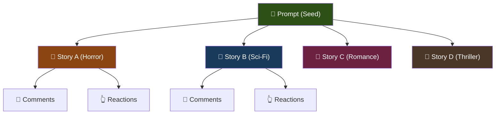
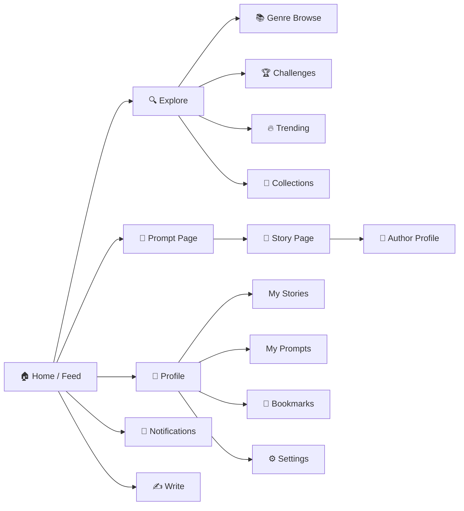
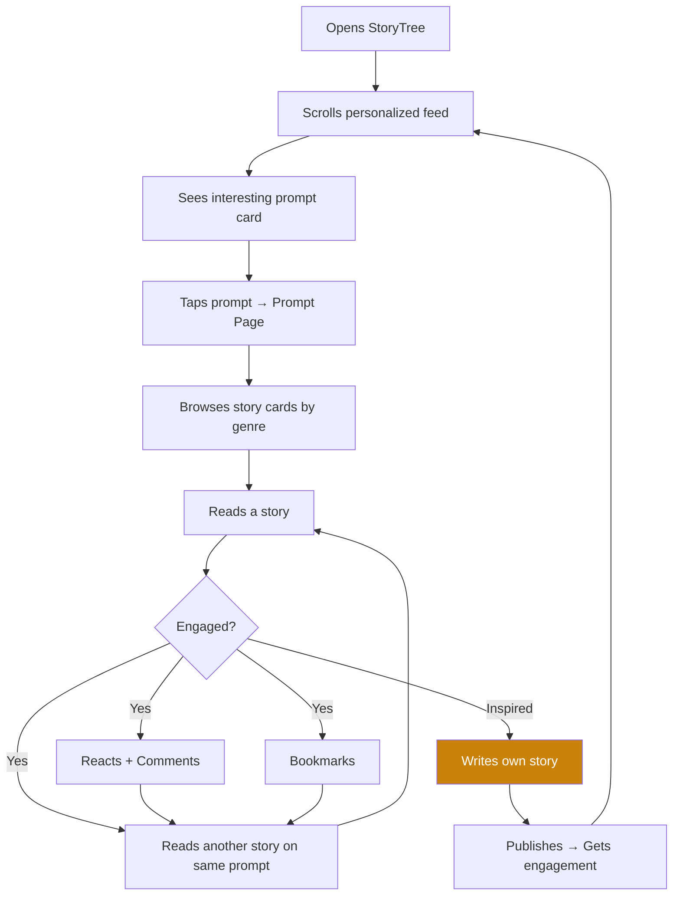
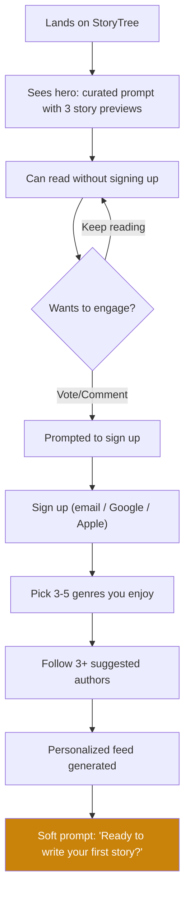
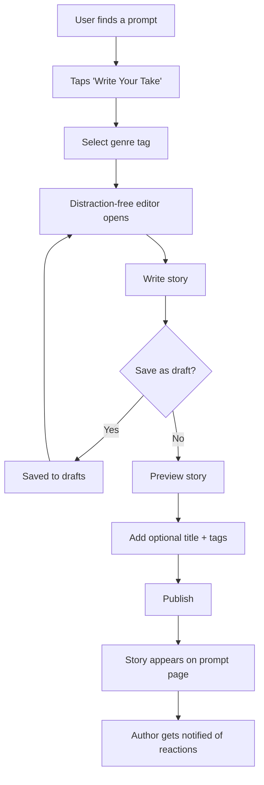
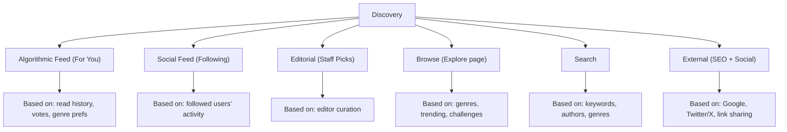
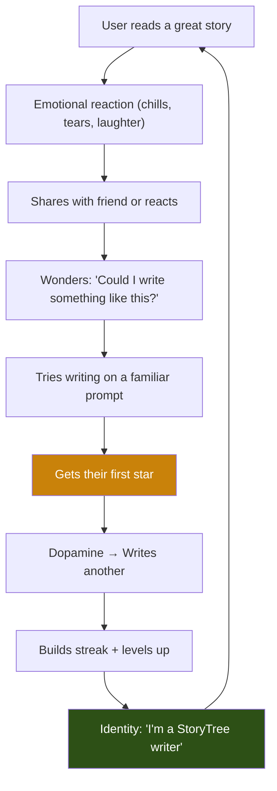

# StoryTree — Product Design Document

> *Every story starts with one idea. One idea creates hundreds of stories.*

---

## 1. Product Identity

### 1.1 What StoryTree Actually Is

StoryTree is a **creative prompt-response platform**. The atomic unit is not a story — it's a **prompt**. A prompt is a seed. Stories are the branches that grow from it. The platform's entire identity flows from this tree metaphor.

The closest mental model:

| Platform | Atomic Unit | Relationship | StoryTree Equivalent |
|----------|------------|--------------|---------------------|
| Quora | Question | One best answer rises | Prompt → Many stories, **all valid** |
| Reddit | Post | Discussion threads | Prompt → Creative interpretations |
| GitHub | Repository | Forks diverge | Prompt → Stories "fork" the idea |
| Medium | Article | Standalone essays | Individual story reading experience |

**The critical difference:** On Quora, divergent answers compete. On StoryTree, divergent stories *enrich each other*. A horror take and a romance take on the same prompt aren't competing — they're demonstrating the power of the original idea.

### 1.2 Brand Personality

| Attribute | What it means | What it does NOT mean |
|-----------|--------------|----------------------|
| **Warm** | Campfire storytelling energy | Not cold/corporate |
| **Playful** | Encourages experimentation | Not childish |
| **Literary** | Respects the craft of writing | Not academic/pretentious |
| **Modern** | Clean, Notion-like polish | Not cluttered like old forums |
| **Inclusive** | All skill levels welcome | Not gatekeeping |

**Voice:** Encouraging, curious, slightly whimsical. Think "a well-read friend who gets excited about your ideas" — not a professor, not a hype influencer.

**Why this matters:** Creative platforms die when they feel intimidating. Wattpad leaned too young. Medium leaned too polished/professional. StoryTree should feel like a place where a first-time writer and a published author both feel at home.

### 1.3 Visual Language

- **Color palette:** Deep forest greens + warm amber/gold accents on dark backgrounds. The "tree" metaphor should feel organic, not digital. Avoid pure whites — use warm off-whites and paper-like tones for reading surfaces.
- **Typography:** A serif font for story reading (literary feel), a clean sans-serif for UI elements (modern feel). This dual-font system signals: "the UI is modern, the content is timeless."
- **Iconography:** Organic, slightly hand-drawn feel. Rounded, not sharp. Think leaves, branches, seeds — not gears and settings icons.
- **Motion:** Gentle, organic animations. Elements should "grow" into view, not snap. Transitions should feel like pages turning, not screens switching.

---

## 2. Information Architecture

### 2.1 Core Data Model



**Key entities:**

| Entity | Description | Created By |
|--------|------------|------------|
| **Prompt** | A creative seed — a "what if" scenario, a concept, a world | Any user |
| **Story** | A creative response to a prompt — a short story, flash fiction, scene | Any user (one per prompt, per user) |
| **Comment** | Discussion on a specific story | Any user |
| **Collection** | A curated group of prompts or stories | Any user or system |
| **Challenge** | A time-limited prompt with special rules | Platform / moderators |

> [!IMPORTANT]
> **One story per prompt per user.** This is a critical constraint. It prevents spam, forces quality over quantity, and makes each story feel intentional. Users can *edit* their story, but they can't flood a prompt with five mediocre takes. If they want to write a second interpretation, they must delete or replace their first.

**Why "one story per prompt per user":** Reddit allows unlimited comments, which leads to noise. By limiting to one, every submission is a considered creative piece, not a throwaway comment. This also creates an interesting decision for the writer: "Which genre/angle do I pick for this prompt?"

### 2.2 Site Map



### 2.3 Navigation Structure

**Primary Navigation (always visible):**

| Item | Icon | Purpose | Why it's primary |
|------|------|---------|-----------------|
| **Home** | 🏠 | Personalized feed | The default experience |
| **Explore** | 🧭 | Discovery beyond feed | Prevents filter bubble |
| **Write** | ✍️ | Create prompt or story | Must be 1-click accessible — reducing friction is everything |
| **Notifications** | 🔔 | Engagement updates | Drives return visits |
| **Profile** | 👤 | Identity & settings | Standard pattern |

**Why "Write" is in the primary nav:** Most platforms bury creation behind 2-3 clicks. StoryTree's lifeblood is user-generated content. The write button should be as prominent as the home button. Make it a distinct color — a warm amber CTA that stands out from the nav. On mobile, it's a floating action button (FAB).

**Secondary Navigation (within Explore):**

| Section | Purpose |
|---------|---------|
| **Trending** | Algorithmically surfaced hot prompts |
| **Genres** | Browse by genre category |
| **Challenges** | Time-limited community writing events |
| **Collections** | Curated prompt bundles (editorial + community) |
| **New** | Freshly posted prompts needing first stories |

> [!TIP]
> **"New" is strategically important.** The cold-start problem for prompts is real — nobody wants to be the first to respond. Surfacing new prompts with zero stories encourages pioneers and distributes attention beyond already-popular prompts. Consider labeling it "Plant a Seed 🌱" to make going first feel special rather than lonely.

---

## 3. User Flows

### 3.1 The Three User Archetypes

| Archetype | Primary Action | Motivation | % of Users (est.) |
|-----------|---------------|------------|-------------------|
| **The Reader** | Reads and votes | Entertainment, inspiration | 70% |
| **The Writer** | Writes stories on prompts | Creative expression, feedback | 20% |
| **The Prompter** | Creates original prompts | Seeing their ideas come to life | 10% |

**Why this matters:** Design for the Reader first (they're 70%), but *incentivize* the Writer and Prompter (they create all the content). The 1-9-90 rule applies: 1% create prompts, 9% write stories, 90% read.

### 3.2 Core User Flows

#### Flow 1: Reader Discovery Loop (The Addiction Engine)



**Why this flow works:** It mirrors the TikTok/Reddit scroll-discover-engage loop but adds a creative output path. The key moment is the transition from **consumer → creator** (node K). Every design decision should lower the barrier to that transition.

#### Flow 2: First-Time User Onboarding



> [!IMPORTANT]
> **Allow reading without sign-up.** This is non-negotiable. The content IS the marketing. If someone finds a StoryTree prompt via Google or social media, they must be able to read stories immediately. Gate engagement (voting, commenting, writing), not consumption. Medium does this well. Wattpad does this poorly.

#### Flow 3: Writing a Story



**Editor design principles:**
- **Zero-config start:** No title required, no settings popup, no template selection. Just a genre dropdown and a blank page.
- **Auto-saving drafts:** Every 30 seconds, silently.
- **Reading time estimate:** Shown in real-time as they write. This is a gentle hint at expected length without enforcing hard limits.
- **Inline formatting only:** Bold, italic, section breaks. No images, no embeds, no tables. This is a writing platform, not a page builder.

---

## 4. Page Designs

### 4.1 Home Page — The Feed

**Purpose:** Give returning users a reason to stay for 20 minutes.

**Layout Structure:**

```
┌──────────────────────────────────────────────────┐
│  [Logo]     [Search]     [✍️ Write]  [🔔] [👤]  │
├──────────────────────────────────────────────────┤
│                                                  │
│  ┌─── Tabs ─────────────────────────────────┐   │
│  │ For You │ Following │ Trending │ New     │   │
│  └──────────────────────────────────────────┘   │
│                                                  │
│  ┌─── Prompt Card ────────────────────────────┐ │
│  │  🌱 "What if humans suddenly stopped       │ │
│  │      dreaming?"                             │ │
│  │                                             │ │
│  │  Posted by @username · 6h ago               │ │
│  │  🔥 47 stories · Horror · Sci-Fi · Romance  │ │
│  │                                             │ │
│  │  ┌──────────┐ ┌──────────┐ ┌──────────┐   │ │
│  │  │ Top story│ │ Top story│ │ Top story│   │ │
│  │  │ preview  │ │ preview  │ │ preview  │   │ │
│  │  │ (Horror) │ │ (Sci-Fi) │ │ (Romance)│   │ │
│  │  │ by @auth │ │ by @auth │ │ by @auth │   │ │
│  │  └──────────┘ └──────────┘ └──────────┘   │ │
│  │                                             │ │
│  │  [✍️ Write Your Take]  [📌 Bookmark]       │ │
│  └─────────────────────────────────────────────┘ │
│                                                  │
│  ┌─── Next Prompt Card ───────────────────────┐ │
│  │  ...                                        │ │
│  └─────────────────────────────────────────────┘ │
│                                                  │
│           ┌──── Right Sidebar ─────┐            │
│           │ 🏆 Weekly Challenge    │            │
│           │ "Write in under 100    │            │
│           │  words..."             │            │
│           │                        │            │
│           │ 📈 Rising Authors      │            │
│           │  @writer1 · @writer2   │            │
│           │                        │            │
│           │ 🏷️ Trending Genres     │            │
│           │  #dystopia #noir       │            │
│           └────────────────────────┘            │
└──────────────────────────────────────────────────┘
```

**Feed Tabs Explained:**

| Tab | Content | Why it exists |
|-----|---------|--------------|
| **For You** | ML-personalized based on reading/voting history | Engagement — shows relevant content |
| **Following** | Prompts/stories from followed users | Social graph — makes following meaningful |
| **Trending** | Highest engagement velocity in last 24h | FOMO / cultural moments |
| **New** | Fresh prompts with 0-3 stories | Distributes attention, fights rich-get-richer |

**The Prompt Card design (most important element on the platform):**

Each card in the feed must answer three questions instantly:
1. **"What's the idea?"** → The prompt text, large and readable
2. **"Is it popular?"** → Story count + genre tags
3. **"What can I expect?"** → 2-3 top story previews (first 1-2 lines + genre + author)

> [!TIP]
> **Show story previews directly on the prompt card.** This is the key differentiator from Reddit (which shows the post, not the comments, in the feed). By showing 2-3 top stories inline, the user can sample the creative diversity without clicking in. This creates a "wow, same prompt, totally different stories" moment that communicates the platform's value instantly.

### 4.2 Prompt Page — The Story Tree

**Purpose:** This is the heart of StoryTree. One prompt, many stories, beautifully organized.

**Layout:**

```
┌──────────────────────────────────────────────────┐
│  ← Back to Feed                                  │
├──────────────────────────────────────────────────┤
│                                                  │
│  🌱 PROMPT                                       │
│  ─────────────────────────────────────────────   │
│  "What if humans suddenly stopped dreaming?"     │
│                                                  │
│  Posted by @username · 6h · 47 stories           │
│  [📌 Bookmark] [🔗 Share] [✍️ Write Your Take]  │
│                                                  │
├──────────────────────────────────────────────────┤
│                                                  │
│  Sort: [🔥 Top] [🕐 New] [💎 Staff Pick]        │
│  Filter: [All] [Horror] [Sci-Fi] [Romance] ...  │
│                                                  │
│  ┌─── Story Card ─────────────────────────────┐ │
│  │  "The Last Dreamer"                         │ │
│  │  🏷️ Horror · 📖 8 min read                  │ │
│  │                                             │ │
│  │  "On the 47th night without dreams, the     │ │
│  │   shadows started moving on their own.      │ │
│  │   First in the corners of rooms nobody      │ │
│  │   entered. Then..."                         │ │
│  │                                             │ │
│  │  by @darkwriter · ⭐ 342 · 💬 28            │ │
│  │  [Read Full Story →]                        │ │
│  └─────────────────────────────────────────────┘ │
│                                                  │
│  ┌─── Story Card ─────────────────────────────┐ │
│  │  "REM Protocol"                             │ │
│  │  🏷️ Sci-Fi · 📖 12 min read                 │ │
│  │  ...                                        │ │
│  └─────────────────────────────────────────────┘ │
│                                                  │
└──────────────────────────────────────────────────┘
```

**Design decisions:**

1. **Genre filter chips** at the top of the story list. This is the killer feature. You can see ALL responses, or filter to just "Horror" or just "Romance." It answers: "How did different genres interpret this idea?"

2. **"Write Your Take" is persistent.** It floats as a sticky bar at the bottom of the prompt page. Every story the user reads should increase their desire to write their own. The CTA must be ever-present.

3. **Story previews show the first 3-4 lines.** Enough to hook, not enough to satisfy. The preview must create curiosity.

4. **Sort by "Staff Pick"** — editorial curation signals quality and gives the platform a curated feel alongside the democratic voting system.

### 4.3 Story Reading Page — The Immersive View

**Purpose:** Distraction-free reading. The story is the star.

```
┌──────────────────────────────────────────────────┐
│  ← Back to Prompt    "What if humans stopped..." │
│                              📖 8 min · Horror   │
├──────────────────────────────────────────────────┤
│                                                  │
│            "The Last Dreamer"                    │
│            by @darkwriter                        │
│                                                  │
│  ─────────────────────────────────────────────   │
│                                                  │
│    On the 47th night without dreams, the         │
│    shadows started moving on their own.          │
│                                                  │
│    First in the corners of rooms nobody          │
│    entered. Then in the hallways of              │
│    hospitals. Then in the bedrooms of            │
│    children who had stopped crying weeks ago     │
│    because their eyes had forgotten how.         │
│                                                  │
│    Dr. Mira Chen hadn't slept in four days.      │
│    Not because she couldn't — because she        │
│    was afraid of what wasn't there when she      │
│    closed her eyes...                            │
│                                                  │
│  ─────────────────────────────────────────────   │
│                                                  │
│  ┌─── Reaction Bar ──────────────────────────┐  │
│  │ ⭐ 342  │ 🔥 Chills │ 🤯 Twist │ 😢 Moved│  │
│  └────────────────────────────────────────────┘  │
│                                                  │
│  ┌─── Comments Section ──────────────────────┐  │
│  │  ...                                       │  │
│  └────────────────────────────────────────────┘  │
│                                                  │
│  ┌─── "More on this prompt" ─────────────────┐  │
│  │  [Next story: "REM Protocol" (Sci-Fi) →]  │  │
│  └────────────────────────────────────────────┘  │
│                                                  │
│  ┌─── Sticky Bottom Bar ────────────────────┐   │
│  │  [✍️ Write Your Take on this Prompt]      │   │
│  └───────────────────────────────────────────┘   │
│                                                  │
└──────────────────────────────────────────────────┘
```

**Critical design decisions:**

1. **Narrow text column** (~600-680px max). Research shows optimal reading width is 50-75 characters per line. This isn't a negotiable design choice — it's readability science. Medium nailed this, and we should too.

2. **"Back to Prompt" always visible.** The reader must always remember: this story exists within the context of a larger prompt. This maintains the tree mental model and encourages reading more interpretations.

3. **"More on this prompt" at the end.** After finishing a story, the reader's next action should be frictionlessly reading another take on the same prompt. Don't send them back to the feed — offer the next story. This is the binge-reading loop.

4. **The Reaction Bar is NOT a simple upvote.** See Section 6 for the full reaction system design.

### 4.4 Profile Page — The Creative Portfolio

**Purpose:** Showcase a user's creative identity. Make writers feel proud of their body of work.

```
┌──────────────────────────────────────────────────┐
│  ┌─────────────────────────────────────────────┐ │
│  │  [Avatar]                                    │ │
│  │  @darkwriter                                 │ │
│  │  "Writing the stories that keep you awake."  │ │
│  │                                              │ │
│  │  🌿 Level: Oak (Tier 4)                      │ │
│  │  📖 23 stories · 🌱 5 prompts · ⭐ 4,280     │ │
│  │  ✨ Top genres: Horror, Thriller, Sci-Fi     │ │
│  │                                              │ │
│  │  [Follow]  [Share Profile]                   │ │
│  └──────────────────────────────────────────────┘ │
│                                                  │
│  ┌─── Tabs ─────────────────────────────────┐   │
│  │ Stories │ Prompts │ Bookmarks │ Badges    │   │
│  └──────────────────────────────────────────┘   │
│                                                  │
│  ┌─── Pinned Story ──────────────────────────┐  │
│  │  📌 "The Last Dreamer" · Horror · ⭐ 342   │  │
│  │  On prompt: "What if humans stopped..."    │  │
│  └────────────────────────────────────────────┘  │
│                                                  │
│  ┌─── Story List ────────────────────────────┐  │
│  │  ...                                       │  │
│  └────────────────────────────────────────────┘  │
│                                                  │
└──────────────────────────────────────────────────┘
```

**Design decisions:**

1. **Genre affinity visible** on the profile. "Top genres: Horror, Thriller, Sci-Fi" — this helps readers find writers who match their taste, and gives writers a creative identity.

2. **Pinned story** — let users showcase their best work at the top. Like Twitter's pinned tweet but for stories.

3. **Stories always show the prompt they responded to.** A story without its prompt context is meaningless. The prompt is always linked.

4. **Bookmarks are semi-public by default** (can be made private). This creates a "reading list" that others can browse — think Spotify playlists for stories. It adds a curation/discovery layer.

---

## 5. Discovery System

### 5.1 How Users Find Content



### 5.2 Explore Page Structure

| Section | Content | Refresh Rate |
|---------|---------|-------------|
| **🔥 Trending Prompts** | Highest engagement velocity (stories/hr + votes/hr) | Real-time |
| **🌱 Fresh Seeds** | New prompts with 0-2 stories (needs attention) | Every 30 min |
| **💎 Staff Picks** | Editorially curated prompts and stories | Daily |
| **🏆 This Week's Challenge** | The active community challenge | Weekly |
| **📚 Genre Spotlight** | Deep-dive into one genre (rotates) | Weekly |
| **🌟 Rising Authors** | Writers gaining followers/votes fastest | Daily |

> [!IMPORTANT]
> **"Fresh Seeds" is the platform's immune system against the popularity trap.** Without it, new prompts die in obscurity while popular ones dominate. Every healthy community platform solves this: Reddit has "New," Hacker News has the ranking decay algorithm, Twitter/X has "For You." StoryTree needs "Fresh Seeds" to be prominently featured and possibly gamified ("earn a badge for being the first to respond to a fresh prompt").

### 5.3 Genre / Category System

**Primary Genres (hard-coded, always visible):**

| Genre | Emoji | Description |
|-------|-------|-------------|
| Horror | 🩸 | Fear, dread, supernatural |
| Sci-Fi | 🚀 | Technology, space, future |
| Fantasy | 🐉 | Magic, mythical worlds |
| Romance | 💕 | Love, relationships |
| Thriller | 🔪 | Suspense, crime, mystery |
| Literary | 📜 | Character-driven, introspective |
| Comedy | 😂 | Humor, satire, absurdist |
| Drama | 🎭 | Emotional, realistic conflict |

**Secondary Tags (community-driven, folksonomy):**

Users add tags like `#dystopia`, `#noir`, `#magical-realism`, `#unreliable-narrator`, `#plot-twist`, `#time-travel`. These emerge organically and create a richer discovery layer.

**Why this two-tier system:** Hard-coded genres provide consistent navigation and a reliable browse experience. Community tags provide nuance and trending topics. Instagram does this well with its category + hashtag system.

> [!WARNING]
> **Do NOT create too many primary genres at launch.** 8-10 is the ceiling. Too many categories fragment the community before it reaches critical mass. Start narrow, expand based on demand. If users keep tagging "Mythology" stories, consider promoting it to a primary genre later.

---

## 6. Community Interactions

### 6.1 The Reaction System (Not Just Upvotes)

**A simple upvote/downvote is wrong for StoryTree.** Here's why:

- **No downvotes.** Creative writing should never be "downvoted." Unlike a factually wrong Quora answer, a story is a person's creative expression. Downvoting it is punishing vulnerability. This kills participation.
- **Upvotes alone are too flat.** A story that "gave me chills" and a story that "made me cry" are both good, but in different ways. A single upvote captures neither.

**Solution: Upvote + Emotional Reactions**

| Reaction | Emoji | Meaning | When to use |
|----------|-------|---------|------------|
| **Star** (primary) | ⭐ | "This is good" | General quality signal (the "upvote") |
| **Chills** | 🔥 | "This gave me goosebumps" | Horror, thriller, intense moments |
| **Mind-blown** | 🤯 | "Didn't see that coming" | Plot twists, creative angles |
| **Moved** | 😢 | "This hit me emotionally" | Drama, romance, literary |
| **Hilarious** | 😂 | "This made me laugh" | Comedy, satire |
| **Beautiful** | ✨ | "The prose is gorgeous" | Literary quality, poetic writing |

**How it works:**
- Every user can give ONE ⭐ star (this is the primary sort metric)
- Additionally, they can select ONE emotional reaction
- The story displays: `⭐ 342 · 🔥 89 · 🤯 56 · 😢 31`
- This gives both a **popularity score** (stars) and an **emotional fingerprint** (reaction distribution)

**Why this is powerful:**
- Writers get specific, meaningful feedback ("89 people got chills from my story" is more motivating than "89 upvotes")
- Readers can sort/filter by reaction type ("show me stories that made people cry")
- The platform can recommend stories by emotional tone, not just popularity

### 6.2 Comments

**Comments exist on stories, NOT on prompts.**

Why? The prompt is a seed — it doesn't need discussion. The stories are the creative work that deserves feedback. Putting comments on prompts would create meta-discussions ("this prompt is too vague," "someone already posted this") that don't add value.

**Comment types:**

| Type | Visual | Purpose |
|------|--------|---------|
| **Feedback** | 💬 | General reaction, discussion |
| **Highlight** | 🖍️ | Inline annotation on a specific paragraph | 

**Inline highlights** are a differentiator. Let readers select a paragraph and comment on it specifically: "This line gave me chills" or "The transition here was masterful." This gives writers **surgical feedback** on what works, not just a generic "great story!"

> [!TIP]
> **Inline highlights create a "masterclass" effect.** When a reader highlights "The shadows started moving on their own" and says "This is where the tone shifts perfectly," other readers learn what makes good writing work. The comments become an implicit writing workshop. This is StoryTree's secret educational value.

### 6.3 Following & Social

- **Follow users** — their new stories/prompts appear in your "Following" feed
- **Follow prompts** — get notified when new stories are added
- **Follow genres** — personalize your feed
- **No "friend" system.** This is a creator-audience relationship, not a social network. Following is one-directional (like Twitter, not Facebook).

### 6.4 Sharing

- **Share a prompt** — "Check out this prompt and its stories"
- **Share a story** — "Read this take on [prompt]"
- **Share card preview** — Rich Open Graph cards showing prompt text + story count + top genre tags (optimized for Twitter/X, Discord, WhatsApp)

> [!IMPORTANT]
> **Social sharing cards are the #1 organic growth channel.** When someone shares a StoryTree prompt on Twitter, the card must be compelling enough to click. Design it to show: the prompt text, the number of stories, and the top 2-3 genre tags. This communicates the platform's value in a single card: "one idea, many stories."

---

## 7. Reputation & Gamification

### 7.1 Reputation System — The Growth Rings

**Metaphor: tree growth rings.** Your reputation grows like a tree — slowly, organically, visibly.

**Reputation Points (called "Rings" 🪵):**

| Action | Rings Earned | Why |
|--------|-------------|-----|
| Story receives a ⭐ | +2 | Rewards quality writing |
| Story receives an emotional reaction | +1 | Rewards emotional impact |
| Your prompt gets a story response | +3 | Rewards good prompt-crafting |
| Comment on your story gets liked | +1 | Rewards discussion engagement |
| You give a ⭐ to someone | +0.5 | Rewards active reading/curating |
| Complete a challenge | +10 | Rewards participation |
| First story on a fresh prompt | +5 | Rewards pioneering |

> [!WARNING]
> **Reputation must reward QUALITY, not QUANTITY.** If a user gets 2 rings per star, someone with one amazing story (500 stars = 1000 rings) ranks higher than someone who spammed 50 mediocre stories (10 stars each = 1000 rings). This is intentional. The system should celebrate craft, not grind.

### 7.2 Level Tiers — The Tree of Growth

| Level | Name | Rings Required | Visual |
|-------|------|---------------|--------|
| 1 | Seed | 0 | 🌱 |
| 2 | Sprout | 50 | 🌿 |
| 3 | Sapling | 200 | 🌳 |
| 4 | Oak | 1,000 | 🌲 |
| 5 | Sequoia | 5,000 | 🏔️🌲 |
| 6 | Ancient | 25,000 | 🌳✨ |

The names follow the tree growth metaphor. They're displayed on profiles and next to usernames in story cards.

### 7.3 Badges & Achievements

**Category 1: Milestones**

| Badge | Condition | Name |
|-------|-----------|------|
| 📖 | Write your first story | "First Words" |
| 🌱 | Create your first prompt | "Planter" |
| 🔟 | Write 10 stories | "Storyteller" |
| 💯 | Get 100 total stars | "Constellation" |
| 🎭 | Write stories in 5 different genres | "Shapeshifter" |

**Category 2: Special Actions**

| Badge | Condition | Name |
|-------|-----------|------|
| 🏴‍☠️ | First story on a fresh prompt | "Pioneer" |
| 🔥 | Get the top story on a trending prompt | "Trailblazer" |
| 🤯 | Get 50+ "Mind-blown" reactions on one story | "Twist Master" |
| 😢 | Get 50+ "Moved" reactions on one story | "Heartstring" |

**Category 3: Consistency**

| Badge | Condition | Name |
|-------|-----------|------|
| 📅 | Write stories 7 days in a row | "Weekly Streak" |
| 🗓️ | Write stories 30 days in a row | "Monthly Streak" |
| 🏆 | Complete 5 community challenges | "Challenger" |

> [!TIP]
> **The "Shapeshifter" badge is strategically important.** It incentivizes writers to try different genres, which: (1) prevents them from being pigeonholed, (2) distributes content across genres, and (3) makes the platform more diverse. Gamification should shape behavior toward platform health.

### 7.4 Writing Streaks

A visual streak counter (like GitHub's contribution graph or Duolingo's streak):

```
This week: 🟩🟩🟩🟩⬜⬜⬜  (4-day streak)
```

- Displayed on the user's profile
- Breaking a streak is okay — no punishment, just reset. We're encouraging habit, not punishing life.
- Streak counts writing a story OR responding to a challenge (low-barrier actions count)

---

## 8. Challenges — The Community Pulse

### 8.1 Weekly Challenges

**Format:**
- A themed prompt posted by the platform every Monday
- Special rules (e.g., "100 words or less," "must include dialogue," "no happy endings")
- Runs for 7 days
- Winners announced Friday (staff picks + community vote)
- Winners get a special badge + profile highlight for the week

**Example challenges:**

| Challenge | Rule | Duration |
|-----------|------|----------|
| "Flash Fiction Friday" | Write a complete story in under 100 words | 48 hours |
| "Genre Swap" | Take a famous fairy tale and rewrite it as horror | 7 days |
| "One Sentence" | The entire story must be a single sentence | 48 hours |
| "Dialogue Only" | No narration, only dialogue | 7 days |

**Why challenges matter:**
1. **Content generation:** They produce a surge of activity every week
2. **Community ritual:** They give users a reason to return on specific days
3. **Skill development:** Constraints make writers better
4. **Social sharing:** "I won this week's StoryTree challenge" is shareable
5. **Low-barrier participation:** Even readers who "don't write" might try a 100-word challenge

---

## 9. Search Experience

### 9.1 Search Architecture

```
┌──────────────────────────────────────┐
│  🔍 Search StoryTree...              │
│                                      │
│  Recent: "time travel" "noir"        │
│                                      │
│  Trending: "AI uprising" "last human"│
└──────────────────────────────────────┘
```

**Search results should be tabbed:**

| Tab | Searches | Example Result |
|-----|----------|---------------|
| **Prompts** | Prompt text | "What if time travel was real but only backwards?" |
| **Stories** | Story title + body text | "The Reverse Clock" by @writer |
| **Authors** | Username + bio | @darkwriter — "Writing horror since 2024" |
| **Tags** | Genre and community tags | #time-travel (847 prompts) |

### 9.2 Smart Filters

After searching, users can filter by:
- **Genre** (multi-select)
- **Length** (Flash fiction / Short / Long)
- **Popularity** (Rising / Popular / All-time top)
- **Recency** (Today / This week / This month / All time)
- **Has my genre** (personalized)

### 9.3 Search Suggestions

As the user types, show:
1. **Autocomplete prompts** matching the query
2. **Matching tags** with post counts
3. **Matching authors** with avatars

> [!TIP]
> **Implement "similar prompts" detection.** When a user creates a new prompt, check for semantic similarity with existing prompts. If a similar prompt exists, show: "A similar prompt already has 23 stories. Add your story there, or create a new prompt?" This prevents duplicate prompts and concentrates community energy.

---

## 10. Mobile Experience

### 10.1 Mobile-First Principles

StoryTree is a **reading platform**. 70%+ of reading happens on mobile. The mobile experience is not a shrunk desktop — it's the primary experience.

### 10.2 Mobile Navigation

```
┌────────────────────────────┐
│  [Logo]         [🔍] [🔔] │
├────────────────────────────┤
│                            │
│     Feed content           │
│     (full-width cards)     │
│                            │
│                            │
│                            │
│                            │
├────────────────────────────┤
│                            │
│  [🏠] [🧭] [✍️] [📌] [👤] │
│  Home Explore Write Saved Me│
└────────────────────────────┘
```

- **Bottom tab bar** (iOS/Android pattern)
- **Write button (✍️)** is center, elevated, accented color — the most prominent element
- **Swipe between stories** on a prompt page (like Instagram stories, but for written stories)

### 10.3 The Story Swipe Experience (Mobile Killer Feature)

On a prompt page, stories are full-screen cards that you **swipe left/right** to navigate between interpretations:

```
┌────────────────────────────┐
│  ← "What if humans stopped │
│     dreaming?"             │
│  ─────────────────────     │
│  🏷️ Horror · 📖 8 min      │
│                            │
│  "The Last Dreamer"        │
│  by @darkwriter            │
│                            │
│  On the 47th night without │
│  dreams, the shadows       │
│  started moving on their   │
│  own. First in the corners │
│  of rooms nobody entered...│
│                            │
│                            │
│  ← Swipe for Sci-Fi take → │
│                            │
├────────────────────────────┤
│  [⭐] [🔥] [🤯] [💬] [📌] │
└────────────────────────────┘
```

**Why swiping works here:** It creates the "same prompt, different story" comparison naturally. Swiping from a horror take to a romance take on the same idea is inherently delightful — it showcases the platform's core value proposition through the interaction pattern itself.

### 10.4 Mobile Writing

- **Quick-write mode:** Tap ✍️ → Select prompt from recent/bookmarked → Genre picker → Editor → Publish
- **Minimal editor:** Large text area, basic formatting, auto-save
- **"Write later" queue:** Bookmark a prompt to your "write later" list for when you have time

---

## 11. Content Quality & Moderation

### 11.1 Quality Signals

| Signal | How it works |
|--------|-------------|
| **Minimum length** | Stories must be 100+ words (prevents "lol nice prompt" responses) |
| **Prompt guidelines** | Prompts must be 20-500 characters (concise seeds, not essays) |
| **Community flagging** | Users can flag content as spam, plagiarism, or off-topic |
| **Plagiarism detection** | Basic text similarity check against existing stories |
| **Rate limiting** | Max 5 stories per day, 3 prompts per day |

### 11.2 Why No Downvotes (Revisited)

Some platforms need downvotes (Stack Overflow — wrong answers are harmful). StoryTree does not. Here's the explicit reasoning:

1. **A story can't be "wrong."** It's creative expression.
2. **Downvotes punish vulnerability.** Writing and sharing a story is inherently vulnerable. Downvotes create fear.
3. **Downvotes create toxicity.** They enable brigading and personal attacks.
4. **The absence of upvotes IS the signal.** A story with 2 stars while others have 200 has already been "ranked" — no downvote needed.
5. **Report/flag handles actual problems.** Spam, plagiarism, and harassment are moderation issues, not voting issues.

---

## 12. Growth & Retention Mechanics

### 12.1 Notification Strategy

| Event | Channel | Urgency |
|-------|---------|---------|
| Someone starred your story | In-app + push | Medium |
| Someone commented on your story | In-app + push | High |
| New story on a prompt you follow | In-app | Low |
| Someone followed you | In-app | Low |
| New weekly challenge | In-app + push + email | Medium |
| Your streak is about to break | Push | Medium |
| Someone you follow posted a new story | In-app | Low |

> [!CAUTION]
> **Do NOT over-notify.** Nothing kills a creative platform faster than notification spam. Default to conservative notification settings. Let users opt IN to more, not opt OUT of less. Respect their attention.

### 12.2 Retention Loops



**The critical conversion:** Node D → E. The moment a reader decides to write. This is where the magic happens. Everything in the UX should gently push toward this moment without being pushy.

### 12.3 Onboarding Nudges

| Timing | Nudge | Why |
|--------|-------|-----|
| After reading 5 stories | "You've read 5 stories. Have you thought about writing your own?" | Testing intent |
| After bookmarking a prompt | "You saved this prompt. Maybe you have a story for it?" | Leveraging intent signal |
| After starring 10 stories | "You clearly know good writing. Show us yours." | Social proof / flattery |
| After 3 days of reading | "Writers who started on StoryTree felt the same way. Here's what happened." | Social proof / case study |

---

## 13. What StoryTree is NOT (Guardrails)

These guardrails prevent scope creep and keep the product focused:

| It is NOT | Why not |
|-----------|---------|
| A screenplay editor | No formatting tools, no industry-standard templates. Stories are prose. |
| A publishing platform | No ebooks, no chapters, no monetization for authors (V1). |
| A social network | No DMs, no friend lists, no status updates (V1). |
| A fan-fiction site | Prompts are original. No copyrighted characters/worlds (legal risk). |
| A writing course | No lessons, no curriculum. Learning happens through community. |
| A long-form platform | Target story length: 500-3,000 words. Not novels. |

---

## 14. Open Questions for Your Input

> [!IMPORTANT]
> These decisions will significantly shape the product. I have recommendations, but they need your sign-off.

1. **Collaborative stories — ever?** Should two users ever be able to co-write a response to a prompt? My recommendation: **No for V1.** It adds enormous complexity and dilutes the "one person, one take" simplicity. Revisit in V2.

2. **Anonymous posting?** Should users be able to post stories anonymously? Pro: removes ego barrier, encourages experimentation. Con: reduces accountability, can enable low-effort content. My recommendation: **Allow anonymous stories, but they don't earn Rings or Badges.** This preserves the incentive system while lowering the barrier.

3. **AI-generated content policy?** This is the elephant in the room. Should AI-generated or AI-assisted stories be allowed? My recommendation: **Allow AI-assisted, ban fully AI-generated.** Require an "AI-assisted" tag. This is hard to enforce but sets a cultural norm. The community values human creativity — that's the whole point.

4. **Monetization (when ready)?** Options include: Premium features (analytics, custom themes, ad-free reading), tipping/patronage for writers, sponsored challenges, a "pro" tier. My recommendation: **Delay monetization until 50K+ MAU.** Focus on community health first.

5. **Target story length?** I suggested 500-3,000 words. Should we allow flash fiction (under 100 words)? Should we allow 10,000+ word stories? My recommendation: **Allow 100-10,000 words.** The UI should guide toward 500-3,000, but don't hard-block creative freedom.

6. **Should prompts support media?** Should prompts be text-only, or can users attach an image/concept art? My recommendation: **Text-only for V1.** Images fragment the creative interpretation — a text prompt leaves more room for imagination. Revisit when the community has stabilized.
